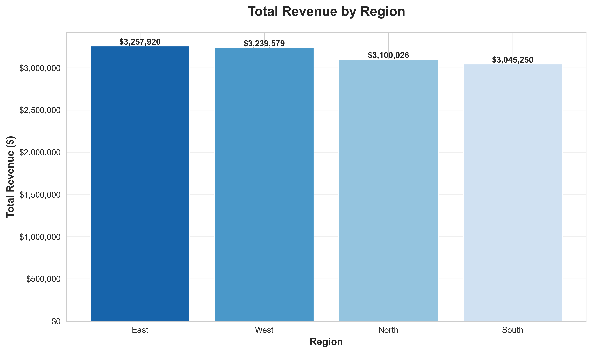
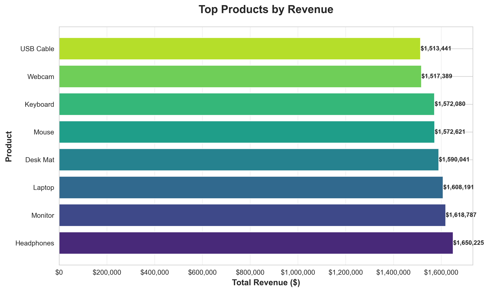
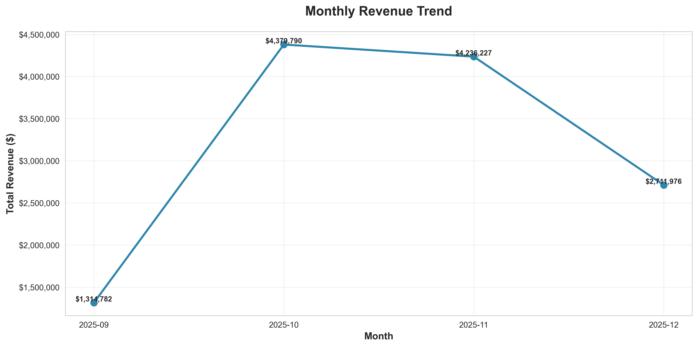
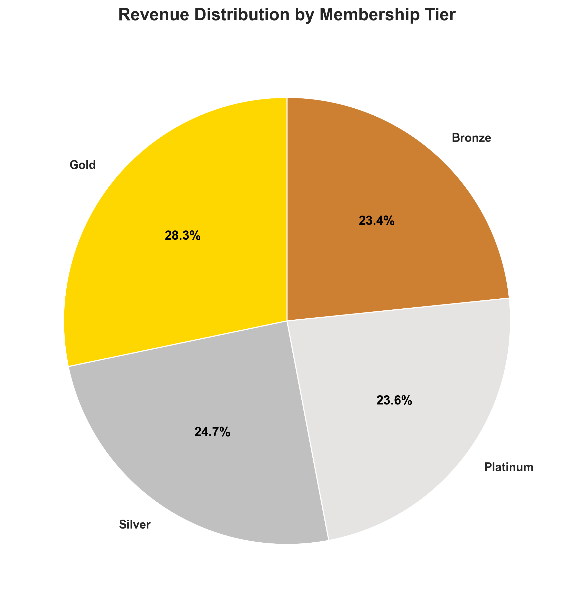
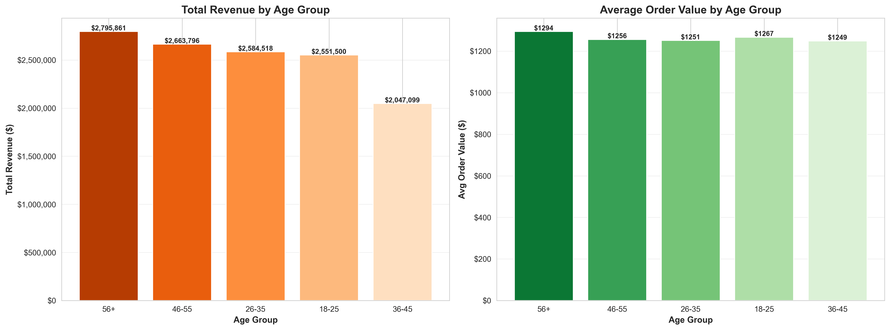
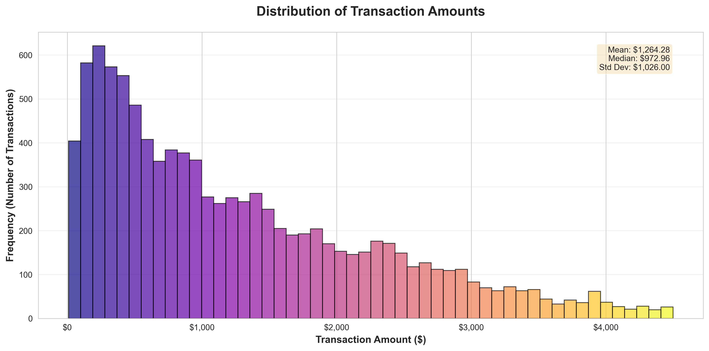

# End-to-End AWS Data Pipeline

## TL;DR
- End-to-end batch ETL pipeline on AWS
- Glue + S3 + Athena + PySpark
- 10K synthetic e-commerce transactions
- Partitioned Parquet data lake
- Cost-optimized (<$1/month)
- SQL analytics + Python visualizations

> **A production-inspired data engineering pipeline demonstrating ETL, data warehousing, and analytics on AWS**

[](https://aws.amazon.com/)
[](https://www.python.org/)
[](LICENSE)

---

## 📊 Project Overview

This project demonstrates a complete **batch ETL data pipeline** on AWS, processing e-commerce sales data from raw ingestion through transformation to analytical insights. Built to showcase cloud data engineering expertise and AWS service integration.

### Business Problem
Organizations need to transform raw transactional data into actionable business intelligence for data-driven decision making. This pipeline automates the extraction, transformation, and loading (ETL) of sales data, making it queryable and ready for analysis.

---

## 🏗️ Architecture
```
┌─────────────────────────────────────────────────────────────────────────┐
│                          DATA PIPELINE FLOW                             │
└─────────────────────────────────────────────────────────────────────────┘

┌──────────────┐      ┌──────────────┐      ┌──────────────┐
│   RAW DATA   │      │   CATALOG    │      │     ETL      │
│              │      │              │      │              │
│  CSV Files   │─────▶│  AWS Glue    │─────▶│  AWS Glue    │
│  JSON Files  │      │  Crawler     │      │  ETL Job     │
│              │      │              │      │  (PySpark)   │
│  Amazon S3   │      │ Data Catalog │      │              │
└──────────────┘      └──────────────┘      └──────────────┘
                                                    │
                                                    ▼
┌──────────────┐      ┌──────────────┐       ┌──────────────┐
│  VISUALIZE   │      |    QUERY     |       |  PROCESSED   |
│              │      |              |       |    DATA      |
│   Python     │◀─────|   Amazon     | ◀─────|   Parquet    |
│  Matplotlib  │      |   Athena     |       |    Files     |
│   Seaborn    │      |    (SQL)     |       |              |
│              │      |              |       |  Amazon S3   |
└──────────────┘      └──────────────┘       └──────────────┘

```

---

## 🎯 Key Features

- **Multi-Source Ingestion**: Processes CSV and JSON data formats
- **Automated Schema Discovery**: Glue Crawler automatically detects data structure
- **Scalable ETL**: PySpark transformations handle large datasets efficiently
- **Optimized Storage**: Parquet columnar format with Snappy compression
- **Partitioned Data**: Year/month partitioning for query performance
- **Cost-Effective**: Serverless architecture with pay-per-use pricing
- **Production-inspired**: Error handling, logging, and monitoring
- **SQL Analytics**: Standard SQL queries via Athena
- **Data Visualization**: Python-generated professional charts

---

## 🛠️ Technologies Used

### AWS Services
| Service | Purpose | Configuration |
|---------|---------|---------------|
| **Amazon S3** | Data lake storage | 3 buckets (raw, processed, scripts) |
| **AWS Glue** | ETL & Data Catalog | Database, Crawler, ETL Job |
| **Amazon Athena** | Serverless SQL queries | Configured with query results bucket |
| **AWS IAM** | Security & permissions | Service role with S3/Glue access |
| **Amazon CloudWatch** | Logging | Automatic Glue job logs (basic monitoring) |

### Programming & Tools
- **Python 3.10** - Data generation, ETL logic, visualizations
- **PySpark** - Distributed data processing (180+ lines)
- **SQL** - Data warehouse queries (12+ analytical queries)
- **Pandas** - Data manipulation and analysis
- **Matplotlib/Seaborn** - Statistical visualizations
- **boto3** - AWS SDK for Python
- **Git/GitHub** - Version control

---

## 📂 Project Structure
```
Project-End-to-End-CloudDataPipeline/
├── generate_sample_data.py          # Creates synthetic sales data (10,000 records)
├── generate_customer_data.py        # Creates customer demographics (500 customers)
├── glue_etl_job.py                  # PySpark ETL transformation script
├── create_visualizations.py         # Python charts from Athena queries
├── athena_queries.sql               # SQL analytical queries
├── requirements.txt                 # Python dependencies
├── screenshots/                     # Generated visualizations (6 charts)
│   ├── 01_revenue_by_region.png
│   ├── 02_top_products.png
│   ├── 03_monthly_trend.png
│   ├── 04_customer_tiers.png
│   ├── 05_age_group_analysis.png
│   └── 06_transaction_distribution.png
└── README.md                        # This file
```

---

## 📈 Data Flow Details

### 1. Data Generation
**Scripts**: `generate_sample_data.py`, `generate_customer_data.py`

Generated synthetic e-commerce data:
- **Sales Data**: 10,000 transactions over 90 days
  - Fields: transaction_id, date, customer_id, product, quantity, unit_price, region, total_amount
- **Customer Data**: 500 customer profiles
  - Fields: customer_id, age_group, membership_tier, signup_date

### 2. Data Ingestion
**Storage**: Amazon S3
```
s3://michel-raw-data-pipeline-project1/input/
├── sales_data.csv                   # 10,000 sales transactions
└── customer_demographics.json       # 500 customer records (newline-delimited)
```

### 3. Data Cataloging
**Service**: AWS Glue Crawler

- **Automatic schema detection** from S3 files
- **Created tables**: `sales_data_csv`, `customer_demographics_json`
- **Database**: `sales_analytics_db`

### 4. ETL Transformation
**Service**: AWS Glue ETL Job (PySpark)

**Transformations applied:**
1. **Data Enrichment**: LEFT JOIN sales with customer demographics on `customer_id`
2. **Date Partitioning**: Extracted `year`, `month`, `day` from transaction date
3. **Aggregation**: Created summary table with:
   - Total revenue by region, product, year, month
   - Transaction counts
   - Average transaction values

**Output format**: Parquet with Snappy compression
- **10x smaller** than CSV
- **100x faster** to query (columnar format)

**Partitioning strategy**:
```
s3://michel-processed-data-pipeline-project1/enriched/
└── year=2025/
    ├── month=9/
    ├── month=10/
    ├── month=11/
    └── month=12/
```

**Benefits**:
- Queries filtering by date only scan relevant partitions
- Significant cost reduction (Athena charges per data scanned)
- Improved query performance

### 5. Data Warehousing
**Service**: Amazon Athena

**Tables created**:
- `enriched_sales` - Full transaction details with customer info (~10,000 records)
- `sales_summary` - Pre-aggregated metrics for fast dashboards

**Query capabilities**:
- Standard SQL (ANSI SQL compatible)
- Sub-second query times on partitioned data
- No infrastructure to manage

### 6. Analytics & Visualization
**Tools**: Python (Matplotlib, Seaborn), SQL

**Queries developed** (see `athena_queries.sql`):
1. Revenue by region analysis
2. Top products by revenue
3. Customer tier spending patterns
4. Monthly sales trends
5. Age group demographics
6. High-value transaction identification
7. And more...

**Visualizations created** (see `screenshots/`):
- Revenue by region (bar chart)
- Top products (horizontal bar)
- Monthly trends (line chart)
- Customer tiers (pie chart)
- Age group analysis (dual bar charts)
- Transaction distribution (histogram)

---

## 💰 Cost Analysis

### Monthly Cost Breakdown (Estimated)

| Service | Usage | Monthly Cost |
|---------|-------|--------------|
| **Amazon S3** | ~5 MB storage, 1,000 requests | **$0.00** (free tier) |
| **AWS Glue Crawler** | 1 run, ~500 objects | **$0.00** (free tier) |
| **AWS Glue ETL** | 1 job run, 2 workers × 5 min | **$0.07** per run |
| **Amazon Athena** | ~10 GB scanned/month | **$0.00** (free tier: 1TB) |
| **CloudWatch Logs** | Basic metrics | **$0.00** (free tier) |
| **Total** | One-time build + occasional runs | **<$1/month** |

**Production scaling**:
- For 1M records/day: ~$50-100/month (still cost-effective)
- Athena cost scales with data scanned (use partitioning!)
- Glue ETL scales horizontally (add more workers)

### Cost Optimization Decisions
1. ✅ **Used Parquet** instead of CSV (10x compression = 10x less Athena cost)
2. ✅ **Partitioned by date** (queries only scan relevant data)
3. ✅ **2 Glue workers** (minimum for Spark, adequate for 10K records)
4. ✅ **Serverless architecture** (no idle server costs)
5. ✅ **S3 Lifecycle policies** (could archive old data to Glacier)

---

## 🚀 Setup & Deployment

### Prerequisites
- AWS Account with admin access
- AWS CLI configured (`aws configure`)
- Python 3.8+ installed
- Git installed

### Step 1: Clone Repository
```bash
git clone https://github.com/Michel-Data-Cloud/cloud-portfolio-aws.git
cd cloud-portfolio-aws/CaseStudies/Project-End-to-End-CloudDataPipeline
```

### Step 2: Set Up Python Environment
```bash
# Create virtual environment
python3 -m venv venv

# Activate virtual environment
source venv/bin/activate  # Mac/Linux
# OR
venv\Scripts\activate  # Windows

# Install dependencies
pip install -r requirements.txt
```

### Step 3: Generate and Upload Data
```bash
# Generate sample data
python generate_sample_data.py
python generate_customer_data.py

# Create S3 buckets (replace 'yourname' with your identifier)
aws s3 mb s3://yourname-raw-data-pipeline-project1
aws s3 mb s3://yourname-processed-data-pipeline-project1
aws s3 mb s3://yourname-glue-scripts-pipeline-project1

# Upload data to S3
aws s3 cp sales_data.csv s3://yourname-raw-data-pipeline-project1/input/
aws s3 cp customer_demographics.json s3://yourname-raw-data-pipeline-project1/input/
```

### Step 4: Set Up AWS Glue
1. **Create IAM Role** for Glue:
   - Service: AWS Glue
   - Policies: `AWSGlueServiceRole`, `AmazonS3FullAccess`. Note: For simplicity, AmazonS3FullAccess was used. In production, this would be replaced with least-privilege bucket-level policies.
   - Name: `GlueServiceRole`

2. **Create Glue Database**:
```bash
   aws glue create-database --database-input '{"Name": "sales_pipeline_db"}'
```

3. **Create and Run Crawler**:
   - AWS Console → Glue → Crawlers → Create Crawler
   - Name: `sales-data-crawler`
   - Data source: `s3://yourname-raw-data-pipeline-project1/input/`
   - IAM role: `GlueServiceRole`
   - Target database: `sales_pipeline_db`
   - Run crawler

4. **Upload and Create ETL Job**:
```bash
   # Upload ETL script
   aws s3 cp glue_etl_job.py s3://yourname-glue-scripts-pipeline-project1/scripts/
   
   # Create job via AWS Console:
   # - Name: sales-etl-pipeline
   # - Script: s3://yourname-glue-scripts-pipeline-project1/scripts/glue_etl_job.py
   # - IAM role: GlueServiceRole
   # - Workers: 2 × G.1X
```

### Step 5: Query with Athena
1. **Configure Athena**:
   - Create bucket: `s3://yourname-athena-results-project1/`
   - Set query result location in Athena settings

2. **Create tables** (run SQL from `athena_queries.sql`):
   - `enriched_sales`
   - `sales_summary`

3. **Run analytical queries** (see `athena_queries.sql`)

### Step 6: Generate Visualizations
```bash
# Update database name in create_visualizations.py if needed
# Then run:
python create_visualizations.py

# Charts saved to screenshots/ folder
```

---

## 📊 Sample Visualizations

### Revenue by Region


**Purpose**: Identifies highest-performing geographic markets for resource allocation and expansion planning.

---

### Top Products


**Purpose**: Highlights best-selling products by revenue to inform inventory management and marketing strategy.

---

### Monthly Revenue Trend


**Purpose**: Tracks sales performance over time to identify seasonal patterns and growth trends.

---

### Customer Tier Distribution


**Purpose**: Analyzes revenue contribution by membership tier to measure loyalty program effectiveness.

---

### Age Group Analysis


**Purpose**: Understands customer demographics and spending patterns for targeted marketing campaigns.

---

### Transaction Distribution


**Purpose**: Statistical analysis of transaction amounts showing distribution pattern and key metrics displayed on chart.

---

## 🎓 Skills Demonstrated

### Cloud Architecture
- ✅ Serverless architecture design
- ✅ Data lake implementation (S3)
- ✅ ETL pipeline development
- ✅ Serverless analytics with Athena
- ✅ Cost optimization strategies
- ✅ Security best practices (IAM)

### Data Engineering
- ✅ Large-scale data processing (PySpark)
- ✅ Data transformation and enrichment (joins, aggregations)
- ✅ Schema evolution handling
- ✅ Partitioning strategies
- ✅ Data quality validation
- ✅ Performance optimization

### Programming
- ✅ Python (data generation, ETL, visualization)
- ✅ PySpark (distributed processing)
- ✅ SQL (complex analytical queries)
- ✅ Version control (Git)
- ✅ Documentation

### Problem-Solving
- ✅ JSON format compatibility issue (newline-delimited)
- ✅ Date type mismatch (Parquet BINARY vs Athena DATE)
- ✅ Performance optimization (partitioning, compression)
- ✅ Cost-conscious decision making

---

## Design Decisions & Tradeoffs
- Glue vs Lambda: Chose Glue for scalable Spark transformations
- Athena vs Redshift: Athena chosen for cost and serverless simplicity
- Batch vs Streaming: Batch selected due to production-inspired business reporting latency requirements

---

## 🔄 Future Enhancements

### Short-term (1-2 weeks)
- [ ] Infrastructure as Code (CloudFormation/Terraform)
- [ ] Automated testing (data quality checks)
- [ ] CI/CD pipeline (GitHub Actions)

### Medium-term (1 month)
- [ ] Real-time ingestion with Kinesis
- [ ] Lambda for event-driven processing
- [ ] Data quality monitoring with Glue DataBrew
- [ ] QuickSight dashboards (or alternative BI tool)

### Long-term (3+ months)
- [ ] Machine learning integration (SageMaker)
- [ ] Multi-region deployment
- [ ] Data governance (AWS Lake Formation)
- [ ] Advanced analytics (predictive models)

---

## 🐛 Known Issues & Solutions

### Issue 1: Date Column Type Mismatch
**Problem**: Glue writes dates as BINARY, Athena expects DATE type  
**Solution**: Define date column as STRING in Athena table, use `substring(date, 1, 10)` for filtering  
**Prevention**: Configure Glue to write Athena-compatible dates

### Issue 2: JSON Array Format
**Problem**: Initial JSON as single array `[{...}, {...}]`, Glue couldn't parse individual records  
**Solution**: Converted to **newline-delimited JSON (NDJSON)** - one JSON object per line:
```
{"customer_id": "CUST0001", "age_group": "26-35"}
{"customer_id": "CUST0002", "age_group": "18-25"}
```  
**Why NDJSON**: Industry standard for big data processing - each line is independently parseable  
**Learning**: Always use NDJSON format for Glue/Athena/Spark compatibility

---

## 📚 Resources & References

### Official Documentation
- [AWS Glue Developer Guide](https://docs.aws.amazon.com/glue/)
- [Amazon Athena User Guide](https://docs.aws.amazon.com/athena/)
- [Amazon S3 Best Practices](https://docs.aws.amazon.com/AmazonS3/latest/userguide/best-practices.html)

### Learning Materials
- [AWS Well-Architected Framework](https://aws.amazon.com/architecture/well-architected/)
- [PySpark Documentation](https://spark.apache.org/docs/latest/api/python/)
- [Parquet Format Specification](https://parquet.apache.org/docs/)

---

## 📧 Contact

**Michel** - Data Engineer  
📧 Email: quantumdatacloud@gmail.com  
💼 LinkedIn: [linkedin.com/in/michel-hidalgo](https://www.linkedin.com/in/michel-hidalgo-46058921/)  
🐙 GitHub: [github.com/Michel-Data-Cloud](https://github.com/Michel-Data-Cloud/cloud-portfolio-aws)

---

## 🙏 Acknowledgments

- AWS for comprehensive cloud services and documentation
- PySpark community for distributed processing framework
- Open source visualization libraries (Matplotlib, Seaborn)

---

**Built with ❤️ to demonstrate cloud data engineering expertise**

*Last updated: January 2025*

