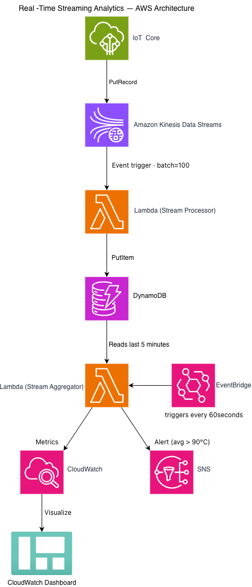

# 🏭 Real-Time Streaming Analytics Pipeline

> **AWS Data Engineering Portfolio — Project 2**
> Serverless IoT sensor monitoring with real-time anomaly detection and alerting


---

## 📋 Table of Contents

1. [Business Problem](#1-business-problem)
2. [Business Value & ROI](#2-business-value--roi)
3. [Architecture](#3-architecture)
4. [AWS Well-Architected Framework](#4-aws-well-architected-framework)
5. [AWS Services Used](#5-aws-services-used)
6. [Key Design Decisions](#6-key-design-decisions)
7. [Repository Structure](#7-repository-structure)
8. [Infrastructure as Code — Terraform](#8-infrastructure-as-code--terraform)
9. [How to Run Locally](#9-how-to-run-locally)
10. [Monitoring & Observability](#10-monitoring--observability)
11. [Security](#11-security)
12. [Cost Analysis](#12-cost-analysis)
13. [Lessons Learned](#13-lessons-learned)
14. [Enhancements Roadmap](#14-enhancements-roadmap)
15. [AWS Certification Mapping](#15-aws-certification-mapping)

---

## 1. Business Problem

A manufacturing plant operates multiple IoT sensors across its production floor. Every machine emits **temperature, pressure, and humidity readings every second**. Without a real-time monitoring system, a malfunctioning machine that begins overheating goes completely undetected until physical damage occurs — triggering costly, unplanned production downtime.

### The Core Challenge

| Problem | Impact |
|---------|--------|
| No real-time visibility into sensor readings | Equipment failures go undetected for hours |
| No automated alerting system | On-call engineers must manually check dashboards |
| Raw sensor data has no business context | A reading of `94.3` means nothing without a threshold |
| Unbounded data growth | Storing every reading forever is expensive and unmanageable |

### What This Pipeline Solves

This project implements a **fully serverless, real-time streaming analytics pipeline** that:

- Ingests raw sensor data continuously via **Amazon Kinesis**
- Processes and enriches each record instantly via **AWS Lambda**
- Stores structured readings with automatic expiry in **Amazon DynamoDB**
- Computes 5-minute windowed aggregations to distinguish real anomalies from sensor noise
- Delivers automated alerts to on-call engineers via **Amazon SNS** within minutes of threshold breach
- Visualises the entire pipeline in a **CloudWatch real-time dashboard**

---

## 2. Business Value & ROI

### What Problem Does This Project Solve?

Manufacturing plants lose money every time a machine breaks down
unexpectedly. A sensor that detects overheating **before** a machine
fails gives engineers time to intervene — preventing the breakdown
entirely. This pipeline is that detection system.

---

### What Does One Downtime Incident Actually Cost?

| Cost Component | Amount |
|----------------|--------|
| Lost production revenue (1 hour stopped) | $180,000 |
| Emergency repair labour and parts | $40,000 |
| Equipment damage from overheating | $20,000 |
| Wasted materials and scrap | $10,000 |
| **Total cost of ONE incident** | **$250,000** |

> **Source:** Aberdeen Group, *The True Cost of Downtime* manufacturing
> research report. The $250,000 figure represents a conservative
> mid-range estimate for discrete manufacturing environments.
> Individual components are itemised above so readers can substitute
> their own figures for their specific industry and plant size.

---

### What Does This Pipeline Cost to Run?

#### Development Environment

| Item | Calculation | Cost |
|------|------------|------|
| Monthly pipeline cost (active testing only) | — | $8/month |
| **Annual pipeline cost** | $8 × 12 months | **$96/year** |

> ⚠️ Dev cost assumes Kinesis is deleted between test sessions.
> Never delete Kinesis in production — it is the live data highway
> for all sensor readings.

#### Production Environment

| Service | 4 Sensors | 100 Sensors | 1,000 Sensors |
|---------|-----------|-------------|---------------|
| Kinesis (24/7) | $11 | $11 | $22 |
| Lambda | ~$0 | ~$2 | ~$18 |
| DynamoDB On-demand | ~$14 | ~$340 | ~$3,400 |
| CloudWatch | ~$8 | ~$10 | ~$15 |
| SNS | ~$0 | ~$0 | ~$1 |
| **Monthly Total** | **~$33** | **~$363** | **~$3,456** |
| **Annual Total** | **~$396** | **~$4,356** | **~$41,472** |

---

### The ROI Calculation — Full Math Shown

The standard ROI formula is:

```
ROI = ((Value Gained - Cost Invested) / Cost Invested) × 100
```

Where:
- **Value Gained** = money saved by preventing one downtime incident = $250,000
- **Cost Invested** = annual cost of running this pipeline

This formula produces a **percentage** — how much return you get
relative to what you spent.

---

#### Development Environment ROI

```
Value Gained   = $250,000  (one prevented incident)
Cost Invested  = $96       (annual dev pipeline cost)

ROI = (($250,000 - $96) / $96) × 100
    = ($249,904 / $96) × 100
    = 2,604 × 100
    = 260,400%
```

> **260,400% ROI** means: for every $1 spent on the pipeline,
> you get $2,601 back in prevented losses — plus your original $1.
> In other words, $1 invested returns $2,602 total.

---

#### Production Environment ROI — All Three Scales

**4 Sensors (Small Production)**

```
Value Gained   = $250,000
Cost Invested  = $396  (annual production cost, 4 sensors)

ROI = (($250,000 - $396) / $396) × 100
    = ($249,604 / $396) × 100
    = 630.3 × 100
    = 63,030%
```

**100 Sensors (Medium Production)**

```
Value Gained   = $250,000
Cost Invested  = $4,356  (annual production cost, 100 sensors)

ROI = (($250,000 - $4,356) / $4,356) × 100
    = ($245,644 / $4,356) × 100
    = 56.4 × 100
    = 5,640%
```

**1,000 Sensors (Large Production)**

```
Value Gained   = $250,000
Cost Invested  = $41,472  (annual production cost, 1,000 sensors)

ROI = (($250,000 - $41,472) / $41,472) × 100
    = ($208,528 / $41,472) × 100
    = 5.03 × 100
    = 503%
```

**Summary Table**

| Scale | Annual Cost | Value Gained | Net Benefit | ROI % |
|-------|-------------|-------------|-------------|-------|
| Dev | $96 | $250,000 | $249,904 | **260,400%** |
| 4 sensors | $396 | $250,000 | $249,604 | **63,030%** |
| 100 sensors | $4,356 | $250,000 | $245,644 | **5,640%** |
| 1,000 sensors | $41,472 | $250,000 | $208,528 | **503%** |

> ✅ Even at the most expensive scale (1,000 sensors, $41,472/year),
> preventing **one** incident returns **503%.**
>
> ```
> Dollars returned per $1 spent = (ROI% / 100) + 1
>                               = (503 / 100) + 1
>                               = 5.03 + 1
>                               = $6.03
> ```
>
> Every $1 invested in the pipeline returns $6.03 back.
> The pipeline pays for itself more than five times over
> from a single prevented incident.

---

### What Does "ROI %" Actually Mean in Plain English?

```
ROI = 260,400%  means:  for every $1 you spend, you get back $2,605
ROI =  63,030%  means:  for every $1 you spend, you get back $631
ROI =   5,640%  means:  for every $1 you spend, you get back $57
ROI =     503%  means:  for every $1 you spend, you get back $6
```

The formula to convert ROI % to "dollars returned per $1 spent":

```
Dollars returned per $1 = (ROI% / 100) + 1

Example: ROI = 63,030%
  = (63,030 / 100) + 1
  = 630.3 + 1
  = $631.30 returned for every $1 spent
```

---

### Why "You Only Need It To Work Once"

This statement means: **one prevented incident generates more value
than the pipeline costs to run for years.**

Here is the exact math showing how many years of operation each
scale can fund from a single prevented incident:

```
Years funded = Value Gained / Annual Cost

Dev           : $250,000 / $96       = 2,604 years of pipeline operation
4 sensors     : $250,000 / $396      =   631 years of pipeline operation
100 sensors   : $250,000 / $4,356   =    57 years of pipeline operation
1,000 sensors : $250,000 / $41,472  =     6 years of pipeline operation
```

> Preventing **one** $250,000 incident at the 1,000-sensor scale
> funds **6 full years** of continuous pipeline operation.
> At the 4-sensor scale, it funds **631 years.**

---

### Break-Even Analysis — Exact Calculations

Break-even answers the question:
> *"How many incidents must this pipeline prevent per year
> just to cover its own annual cost?"*

```
Break-Even Incidents = Annual Cost / Value per Incident

Dev           : $96       / $250,000 = 0.000384 incidents/year
4 sensors     : $396      / $250,000 = 0.001584 incidents/year
100 sensors   : $4,356    / $250,000 = 0.017424 incidents/year
1,000 sensors : $41,472   / $250,000 = 0.165888 incidents/year
```

**Converting to "years between incidents" — exact math:**

```
Years between incidents = 1 / Break-Even Incidents per Year

Dev           : 1 / 0.000384  = 2,604 years between incidents
4 sensors     : 1 / 0.001584  =   631 years between incidents
100 sensors   : 1 / 0.017424  =    57 years between incidents
1,000 sensors : 1 / 0.165888  =     6 years between incidents
```

**Summary Table — Full Calculations Shown**

| Scale | Annual Cost | Break-Even Calc | Incidents/Year | Years Between |
|-------|-------------|----------------|---------------|---------------|
| Dev | $96 | $96 ÷ $250,000 | 0.000384 | 2,604 yrs |
| 4 sensors | $396 | $396 ÷ $250,000 | 0.001584 | 631 yrs |
| 100 sensors | $4,356 | $4,356 ÷ $250,000 | 0.017424 | 57 yrs |
| 1,000 sensors | $41,472 | $41,472 ÷ $250,000 | 0.165888 | 6 yrs |

> **How to read this table:**
> The pipeline at the 1,000-sensor scale breaks even if it prevents
> just 0.166 incidents per year — meaning one incident every 6 years.
> Manufacturing plants typically experience multiple equipment failures
> per year, making this threshold trivially easy to exceed.

---

### In Plain English — For Any Audience

> **Think of this pipeline like a smoke detector.**
>
> A smoke detector costs **$30/year** to maintain.
> It protects a house worth **$300,000.**
>
> You do not calculate ROI before buying a smoke detector.
> The math is obvious: the cost of protection is so small
> relative to the cost of the disaster it prevents that
> the only question is why you would NOT have one.
>
> This pipeline costs **$33/month ($396/year)** in production.
> It protects against a **$250,000** downtime incident.
>
> The break-even point is preventing one incident every **631 years.**
> Manufacturing plants experience equipment failures far more
> frequently than once every 631 years.
> **The pipeline pays for itself many times over.**

---

### Design Choices That Drive Business Value

| Decision | Business Impact |
|----------|----------------|
| **5-minute windowed average** for anomaly detection | Eliminates false positives from sensor noise — reduces wasted engineer callouts |
| **TTL-based auto-expiry** (7 days) | Storage costs stay near zero without any maintenance job or manual cleanup |
| **Fully serverless architecture** | Lambda and DynamoDB cost nothing when idle — only Kinesis has a continuous charge in production |
| **All resources tagged** with `Project` and `Environment` | Enables granular Cost Explorer tracking and chargeback reporting by project |
| **SNS email alerts** | On-call engineers notified within seconds of threshold breach — no manual dashboard monitoring required |

> ⚠️ **Note on serverless costs:** Lambda and DynamoDB are truly
> serverless — they cost nothing when not processing data.
> Kinesis is the exception: it charges $0.015/shard/hour even when
> the stream is empty. This is why deleting the Kinesis stream
> between development sessions is the single most effective cost
> control measure for this project. In production, Kinesis runs
> continuously and must never be deleted.

---

## 3. Architecture

### Data Flow Diagram

### Detailed Architecture — AWS Service Icons



### Architecture Decisions at a Glance

| Layer | Choice | Rationale |
|-------|--------|-----------|
| Ingestion | Kinesis Data Streams (Provisioned) | Teaches shard math; On-demand recommended for production |
| Processing | Lambda (event-driven) | Serverless, scales to zero, zero idle cost |
| Storage | DynamoDB (On-demand) | NoSQL time-series design; auto-scales for burst writes |
| Aggregation | Lambda (scheduled, EventBridge) | Decoupled from ingest; windowed logic in code |
| Alerting | SNS (email) | Simple, reliable, no infrastructure to manage |
| Monitoring | CloudWatch | Native AWS; no additional tooling required |
| IaC | Terraform | Cloud-agnostic, version-controlled, repeatable |

> 📷 See `/docs/screenshots/` for live pipeline screenshots.

---

## 4. AWS Well-Architected Framework

This project was designed and built with the **AWS Well-Architected Framework** as a guiding structure. The six pillars informed every architectural decision made — from key schema design to IAM role scoping to TTL configuration.

---

### Pillar 1 — Operational Excellence

> *The ability to run and monitor systems to deliver business value and to continually improve supporting processes and procedures.*

| Practice | Implementation |
|----------|---------------|
| **Infrastructure as Code** | 100% of infrastructure defined in Terraform. Every resource is version-controlled, reviewable, and deployable from scratch with `terraform apply` |
| **Structured logging** | All Lambda functions emit consistent structured log lines with `sensor_id`, `timestamp`, `temperature`, and `status` fields — queryable via CloudWatch Logs Insights |
| **Runbook in README** | This README serves as the operational runbook — deploy steps, run steps, expected outputs, and troubleshooting guidance all documented |
| **Tagging strategy** | All resources tagged with `Project`, `Environment`, and `ManagedBy` from day one — enables Cost Explorer filtering, access control by tag, and resource inventory |

```sql
-- Example CloudWatch Logs Insights query for operational debugging
fields @timestamp, sensor_id, temperature, status
| filter status = "critical"
| sort @timestamp desc
| limit 20
```

---

### Pillar 2 — Security

> *The ability to protect data, systems, and assets to take advantage of cloud technologies to improve your security.*

| Practice | Implementation |
|----------|---------------|
| **Least-privilege IAM** | Two separate IAM roles — one per Lambda. Each role scoped to exact resources and exact actions needed. No wildcard resources on sensitive permissions |
| **No hardcoded credentials** | Zero credentials in source code. All sensitive ARNs in Lambda environment variables. Production: AWS Systems Manager Parameter Store |
| **Encryption at rest** | DynamoDB (DynamoDB owned key), SNS (AWS managed KMS key), Kinesis (AWS managed KMS key) |
| **Encryption in transit** | All AWS SDK calls use HTTPS/TLS by default |
| **Topic access policy** | SNS topic policy restricts publishing to account owner + CloudWatch Alarms only — prevents unauthorised alert injection |
| **Custom IAM policies** | Terraform IaC uses custom inline policies with specific ARNs rather than broad AWS managed policies used during console learning phase |

**Security Improvement: Console → Terraform**

> During the console build phase, AWS managed policies (e.g. `AmazonDynamoDBFullAccess`) were used for speed while learning the services. The Terraform IaC upgrades every policy to a **custom least-privilege policy** scoped to specific resource ARNs. This is documented intentionally to show understanding of the tradeoff between convenience during development and security in production.

**Production Security Enhancements (Documented)**

- [ ] Customer Managed Keys (CMK) via AWS KMS for DynamoDB, SNS, and Kinesis
- [ ] VPC endpoints for DynamoDB and Kinesis — removes public internet data path
- [ ] AWS CloudTrail enabled for full API call audit trail
- [ ] IAM Access Analyzer to continuously validate role permission boundaries
- [ ] AWS Config rules for continuous compliance monitoring
- [ ] Secrets Manager for any future credentials (database passwords, API keys)

---

### Pillar 3 — Reliability

> *The ability of a system to recover from infrastructure or service disruptions, dynamically acquire computing resources to meet demand, and mitigate disruptions.*

| Practice | Implementation |
|----------|---------------|
| **Multi-AZ by default** | Kinesis replicates across 3 AZs. DynamoDB is inherently multi-AZ. Lambda runs in multiple AZs |
| **Per-record error handling** | Processor Lambda wraps each record in individual try/except — one malformed record cannot fail the entire batch |
| **Kinesis retry logic** | `bisect_batch_on_function_error = true` in event source mapping. On error, batch is split in half to isolate the bad record |
| **Exponential backoff** | Producer script retries failed Kinesis `PutRecord` calls with exponential backoff (0.5s, 1s, 2s) up to 3 attempts |
| **Idempotent writes** | DynamoDB `PutItem` with the same `sensor_id + timestamp` key is idempotent — safe to retry without duplicating data |
| **CloudWatch Alarms** | Four alarms covering all three pipeline layers (ingestion, processing, storage) with SNS notification for fast incident response |

**Single Points of Failure Addressed**

| Risk | Mitigation |
|------|-----------|
| Lambda cold start latency | 256MB memory allocation reduces cold start duration |
| Kinesis shard throttling | Exponential backoff in producer; bisect-on-error in event source mapping |
| DynamoDB write failure | Per-record exception handling; failed items logged for manual replay |
| Aggregator Lambda failure | CloudWatch alarm fires within 60 seconds of any error |

---

### Pillar 4 — Performance Efficiency

> *The ability to use computing resources efficiently to meet system requirements, and to maintain that efficiency as demand changes and technologies evolve.*

| Practice | Implementation |
|----------|---------------|
| **Right-sized Lambda** | 256MB memory — benchmarked for this workload. More memory = more CPU in Lambda; over-allocating wastes money |
| **Kinesis batch processing** | 10-second batch window + 100-record batch size reduces Lambda invocations by up to 100x vs per-record invocation |
| **DynamoDB Query not Scan** | All DynamoDB access uses `Query` with `KeyConditionExpression`. Query is O(result set size); Scan is O(table size). At scale, Scan can cost 1000x more |
| **Partition key design** | `sensor_id` as partition key distributes writes evenly. Timestamp as partition key would create a hot partition since all sensors write simultaneously |
| **Lambda container reuse** | AWS clients (`boto3.resource`, `boto3.client`) instantiated outside the handler — reused across warm invocations at no extra cost |
| **DynamoDB On-demand** | Eliminates capacity planning; auto-scales for burst writes during testing without throttling |

**Throughput Capacity at 1 Shard**

```
Kinesis capacity  : 1,000 records/sec or 1 MB/sec (ingest)
Current workload  : 4 sensors × 1 record/sec = 4 records/sec
Headroom          : 249x before shard split needed
Scale trigger     : Add 1 shard per 1,000 sensors added
```

---

### Pillar 5 — Cost Optimization

> *The ability to run systems to deliver business value at the lowest price point.*

| Practice | Implementation |
|----------|---------------|
| **Serverless architecture** | Lambda and DynamoDB On-demand = zero cost when idle. No EC2 instances running overnight |
| **TTL data expiry** | 7-day auto-deletion prevents unbounded DynamoDB storage growth at zero cost |
| **Right-sized retention** | Kinesis 24-hour retention (minimum, free). CloudWatch Logs 30-day retention (prevents infinite log accumulation) |
| **DynamoDB On-demand** | No provisioned capacity sitting idle. Scales down to zero between test runs |
| **Billing alarm** | $10/month budget alert in AWS Budgets — prevents surprise bills during development |
| **Resource tagging** | All resources tagged for Cost Explorer filtering and per-project cost attribution |
| **Kinesis cost awareness** | Documented: Kinesis is the primary cost driver ($0.015/shard/hour). Delete or stop when not testing |

> ⚠️ **Development only:** Delete or stop the Kinesis stream between
> test sessions to avoid the $0.015/shard/hour idle charge.
> In production, Kinesis runs continuously — it must never be deleted
> as it is the live data highway for all sensor readings.

### Development Cost (Active Testing Only)

| Service | Usage Assumption | Monthly Cost |
|---------|-----------------|-------------|
| Kinesis | 1 shard, ~3 hrs/day testing | ~$1–3 |
| Lambda | Well within free tier | ~$0 |
| DynamoDB | On-demand, minimal writes | ~$1 |
| CloudWatch | 1 dashboard + metrics | ~$5 |
| SNS | Well within free tier | ~$0 |
| **Total** | | **~$7–9/month** |

> Dev tip: Delete Kinesis between sessions. It is the only idle cost driver.

---

### Production Cost (3 Realistic Scales)

| Service | 4 Sensors (small) | 100 Sensors (medium) | 1,000 Sensors (large) |
|---------|-------------------|---------------------|----------------------|
| **Kinesis** | 1 shard = $11 | 1 shard = $11 | 2 shards = $22 |
| **Lambda** | ~$0 (free tier) | ~$2 | ~$18 |
| **DynamoDB** | ~$14 | ~$340 | ~$3,400* |
| **CloudWatch** | ~$8 | ~$10 | ~$15 |
| **SNS** | ~$0 | ~$0 | ~$1 |
| **Monthly Total** | **~$33** | **~$363** | **~$3,456*** |
| **Annual Total** | **~$396** | **~$4,356** | **~$41,472*** |

*At 1,000+ sensors, switch DynamoDB from On-demand to Provisioned
mode (~30% savings) and add Kinesis Data Analytics for pre-aggregation
to reduce DynamoDB write volume. Realistic large-scale cost after
optimisation: ~$1,800–2,200/month.

### What Drives Production Costs?

| Scale | Primary Cost Driver | Optimisation |
|-------|-------------------|-------------|
| Small (4 sensors) | CloudWatch fixed fees | Accept — minimal |
| Medium (100 sensors) | DynamoDB write volume | Consider Provisioned mode |
| Large (1,000+ sensors) | DynamoDB write volume | Provisioned + pre-aggregation |

### Production ROI at Each Scale

| Scale | Monthly Cost | Incidents Prevented/Year to Break Even |
|-------|-------------|---------------------------------------|
| Small | $33 | 0.002 incidents (less than 1 per 500 years) |
| Medium | $363 | 0.017 incidents (less than 1 per 58 years) |
| Large | $3,456 | 0.17 incidents (less than 1 per 6 years) |

> At every scale, preventing a single $250,000 downtime incident
> pays for years of pipeline operation.

---

### Pillar 6 — Sustainability

> *Minimising the environmental impacts of running cloud workloads.*

| Practice | Implementation |
|----------|---------------|
| **Serverless = no idle compute** | Lambda and DynamoDB On-demand consume zero compute resources when not processing data — no always-on servers |
| **Right-sized resources** | 256MB Lambda memory avoids over-provisioning energy consumption |
| **TTL data management** | Automatic deletion of expired data reduces storage footprint continuously |
| **Single region deployment** | Consolidating all resources in `us-east-1` avoids unnecessary cross-region data transfer |
| **Efficient batch processing** | 10-second Kinesis batch window groups records before Lambda invocation — fewer invocations = less compute energy per record |

---

## 5. AWS Services Used

| Service | Purpose | Key Concepts Demonstrated |
|---------|---------|--------------------------|
| **Amazon Kinesis Data Streams** | Real-time data ingestion from IoT sensors | Shard sizing, partition keys, throughput math, retention |
| **AWS Lambda** | Stream processing and scheduled aggregation | Event-driven compute, batch processing, error handling |
| **Amazon DynamoDB** | NoSQL time-series storage | Key design, GSI, TTL, Query vs Scan, On-demand billing |
| **Amazon CloudWatch** | Metrics, alarms, real-time dashboard | Custom metrics, composite alarms, dashboard JSON |
| **Amazon SNS** | Anomaly alert delivery | Topic policies, subscriptions, encryption |
| **AWS IAM** | Least-privilege access control | Custom policies, resource-scoped permissions, trust policies |
| **Amazon EventBridge** | Scheduled Lambda invocation | Rate expressions, event targets, Lambda permissions |

---

## 6. Key Design Decisions

Every decision below was made intentionally and can be justified in a technical interview.

---

### 6.1 DynamoDB Key Design — `sensor_id` (PK) + `timestamp` (SK)

**Decision:** Composite primary key with `sensor_id` as partition key and `timestamp` as sort key.

**Why:** DynamoDB requires designing around access patterns, not data shape. Our primary access pattern is *"give me all readings for sensor X between time Y and time Z"* — this maps perfectly to a Query on `sensor_id` with a `timestamp` range condition.

**Alternative Rejected:** Using `timestamp` as the partition key would create a **hot partition** — all four sensors write at the same second, so all writes would hit the same partition, throttling the entire table.

---

### 6.2 Global Secondary Index — `location-timestamp-index`

**Decision:** GSI on `location` (PK) + `timestamp` (SK).

**Why:** Enables the ops team query *"show me all sensors on Floor A in the last 10 minutes"* without a full table scan. Without this GSI, that query reads every item in the table regardless of location — O(table size) instead of O(result size).

---

### 6.3 DynamoDB On-demand Billing Mode

**Decision:** `PAY_PER_REQUEST` for the development environment.

**Why:** Unpredictable test workload. On-demand scales automatically and never throttles — critical during burst testing with the producer script. Production recommendation: benchmark sustained throughput and switch to Provisioned for ~30% cost savings.

---

### 6.4 5-Minute Windowed Anomaly Detection

**Decision:** Alert only when the **5-minute rolling average** exceeds 90°C, not on individual readings.

**Why:** A single high reading is statistically likely to be sensor noise, a transmission error, or a momentary spike. A sustained 5-minute average above the critical threshold indicates a genuine equipment issue requiring human intervention. This design decision directly reduces false positives and prevents alert fatigue for the operations team.

---

### 6.5 Separate IAM Roles Per Lambda Function

**Decision:** `streaming-analytics-processor-role` and `streaming-analytics-aggregator-role` are separate roles with separate policies.

**Why:** Least privilege. The processor needs Kinesis read + DynamoDB write only. The aggregator needs DynamoDB read + CloudWatch write + SNS publish only. A single shared role would grant each function permissions it does not need — violating the principle of least privilege and expanding the blast radius of any compromise.

---

### 6.6 TTL = 7 Days

**Decision:** All sensor records auto-expire 7 days after creation.

**Why:** Real-time monitoring data has diminishing operational value after 7 days. Retaining it forever increases storage costs continuously with no corresponding business benefit for this use case. Long-term analytical storage belongs in **S3 via Kinesis Data Firehose** (documented as a roadmap enhancement). DynamoDB TTL deletion is free, asynchronous, and requires no operational overhead.

---

### 6.7 Kinesis Provisioned Mode (1 Shard)

**Decision:** Provisioned mode with 1 shard for the development and portfolio environment.

**Why:** Intentional learning choice. Provisioned mode requires understanding shard math — how many records per second, how many bytes per second, when to split or merge. This knowledge is tested directly in the AWS Certified Data Engineer exam. Production recommendation: On-demand mode eliminates shard management for unpredictable IoT device scale.

---

### 6.8 Environment Variables for Lambda Configuration

**Decision:** `TABLE_NAME`, `SNS_TOPIC_ARN`, `ANOMALY_THRESHOLD`, and `WINDOW_MINUTES` are Lambda environment variables, not hardcoded in source code.

**Why:** Decouples configuration from code. Enables environment promotion (dev → staging → prod) by changing environment variables only, with zero code changes. Keeps sensitive ARNs out of version control. Production enhancement: migrate to **AWS Systems Manager Parameter Store** for centralised management, version history, and access audit trail.

---

## 7. Repository Structure

```
streaming-analytics/
│
├── terraform/                        # Infrastructure as Code
│   ├── main.tf                       # AWS provider, region, default tags
│   ├── variables.tf                  # All configurable values centralised
│   ├── outputs.tf                    # Resource ARNs + dashboard URL post-deploy
│   ├── kinesis.tf                    # Kinesis Data Stream + encryption
│   ├── iam.tf                        # IAM roles + least-privilege custom policies
│   ├── dynamodb.tf                   # DynamoDB table + GSI + TTL + encryption
│   ├── lambda.tf                     # Both Lambda functions + triggers + EventBridge
│   ├── sns.tf                        # SNS topic + access policy + email subscription
│   └── cloudwatch.tf                 # Log groups + 4 alarms + dashboard
│
├── lambda/
│   ├── processor/
│   │   └── handler.py                # Kinesis → DynamoDB stream processor
│   └── aggregator/
│       └── handler.py                # DynamoDB → CloudWatch + SNS aggregator
│
├── producer/
│   └── producer.py                   # IoT sensor simulator (normal + anomaly modes)
│
├── docs/
│   └── screenshots/                  # Live pipeline evidence
│       ├── 01-dashboard-live.png     # Full CloudWatch dashboard with data
│       ├── 02-dynamodb-items.png     # DynamoDB enriched records
│       ├── 03-processor-logs.png     # Lambda processor CloudWatch logs
│       ├── 04-aggregator-logs.png    # Lambda aggregator CloudWatch logs
│       ├── 05-kinesis-metrics.png    # Kinesis stream monitoring tab
│       ├── 06-sns-alert-email.png    # Anomaly alert email received
│       └── 07-alarms-ok-state.png    # All 4 alarms in OK state
│
|── .gitignore                        # Protects sensitive files from GitHub
|
└── README.md                         # This file
```

---

## 8. Infrastructure as Code — Terraform

All infrastructure in this project is defined as code in Terraform. The console was used during the build phase for learning — the Terraform files represent the production-grade, repeatable, version-controlled definition of the same infrastructure.

### Terraform File Map

| File | Resources Defined |
|------|------------------|
| `main.tf` | AWS provider, required version, default tags |
| `variables.tf` | 12 configurable variables with descriptions and validation |
| `outputs.tf` | 9 outputs including stream ARN, table ARN, dashboard URL |
| `kinesis.tf` | `aws_kinesis_stream` with KMS encryption |
| `iam.tf` | 2 roles, 2 custom policies, 2 policy attachments |
| `dynamodb.tf` | `aws_dynamodb_table` with GSI, TTL, and encryption |
| `lambda.tf` | 2 functions, 1 event source mapping, 1 EventBridge rule + target + permission |
| `sns.tf` | `aws_sns_topic`, topic policy, email subscription |
| `cloudwatch.tf` | 2 log groups, 4 metric alarms, 1 dashboard with 6 widgets |

### Deploy from Scratch

```bash
# Prerequisites: AWS CLI configured, Terraform >= 1.5.0 installed

# 1. Clone the repository
git clone https://github.com/[your-username]/streaming-analytics.git
cd streaming-analytics/terraform

# 2. Update your alert email address in variables.tf
#    Change: default = "your-email@example.com"
#    To:     default = "your-real-email@example.com"

# 3. Initialise Terraform (downloads AWS provider)
terraform init

# 4. Preview all resources that will be created
terraform plan

# 5. Deploy everything — approximately 25 resources
terraform apply

# 6. View the outputs (stream name, table name, dashboard URL)
terraform output
```

### Expected Outputs After Apply

```
aws_account_id          = "123456789012"
aws_region              = "us-east-1"
kinesis_stream_name     = "streaming-analytics-sensor-stream"
kinesis_stream_arn      = "arn:aws:kinesis:us-east-1:..."
dynamodb_table_name     = "streaming-analytics-sensor-readings"
dynamodb_table_arn      = "arn:aws:dynamodb:us-east-1:..."
processor_lambda_name   = "streaming-analytics-stream-processor"
aggregator_lambda_name  = "streaming-analytics-stream-aggregator"
sns_topic_arn           = "arn:aws:sns:us-east-1:..."
cloudwatch_dashboard_url = "https://us-east-1.console.aws.amazon.com/..."
```

### Tear Down (Avoid Ongoing Costs)

```bash
terraform destroy
```

> ⚠️ **Always run `terraform destroy` when done.** Kinesis charges $0.015/shard/hour
> even when no data is flowing. A single shard left running costs ~$10.80/month.

---

## 9. How to Run Locally

### Prerequisites

```bash
# Install the AWS Python SDK
pip install boto3

# Verify AWS credentials are configured
aws sts get-caller-identity
```

### Producer Script Modes

```bash
cd producer

# --- NORMAL MODE ---
# Generates realistic sensor readings (temperature 60–85°C)
# All 4 sensors, 1 reading per sensor per second
# Runs until Ctrl+C
python producer.py

# Normal mode with a fixed duration (120 seconds)
python producer.py --duration 120

# --- ANOMALY MODE ---
# Spikes sensor-floor-A-01 above the 90°C threshold (91–98°C)
# Run for 6+ minutes to trigger the 5-minute windowed SNS alert
python producer.py --mode anomaly --duration 360

# Custom interval (send every 2 seconds)
python producer.py --interval 2
```

### Expected Terminal Output

```
============================================================
  Real-Time Streaming Analytics — IoT Sensor Producer
============================================================
  Stream   : streaming-analytics-sensor-stream
  Region   : us-east-1
  Mode     : NORMAL
  Sensors  : 4
  Interval : 1.0s per batch
  Duration : Until Ctrl+C
============================================================
  Press Ctrl+C to stop

  🌡 Batch 0001 | sensor-floor-A-01 | temp= 72.4°C | pressure=1013.2hPa | humidity=45.1%
  🌡 Batch 0001 | sensor-floor-A-02 | temp= 68.9°C | pressure=1001.7hPa | humidity=52.3%
  🌡 Batch 0001 | sensor-floor-B-01 | temp= 77.1°C | pressure= 995.4hPa | humidity=38.6%
  🌡 Batch 0001 | sensor-floor-B-02 | temp= 81.2°C | pressure=1021.8hPa | humidity=61.0%

  📊 Progress | batches=10 | records_sent=40 | failed=0 | elapsed=10s
```

### End-to-End Validation Checklist

- [ ] Producer output shows records being sent (no errors)
- [ ] DynamoDB items appear with `status`, `processed_at`, and `ttl` fields
- [ ] CloudWatch Logs show processor Lambda batch completions
- [ ] CloudWatch dashboard widgets populate with live metrics
- [ ] All 4 CloudWatch alarms transition to **OK** state
- [ ] Running anomaly mode for 6 minutes triggers SNS email alert
- [ ] SNS alert email contains correct sensor ID and average temperature

---

## 10. Monitoring & Observability

A core principle of this project is that **observability is not optional** — it is a first-class deliverable built alongside the pipeline, not added afterward.

### CloudWatch Dashboard — `streaming-analytics-dashboard`

The dashboard provides a single-pane-of-glass view of the entire pipeline:

| Widget | Metric | What It Tells You |
|--------|--------|-------------------|
| Kinesis Incoming Records | `AWS/Kinesis IncomingRecords` | Data ingestion rate — is data flowing in? |
| Processor Invocations/Errors | `AWS/Lambda Invocations + Errors` | Is the processor running cleanly? |
| Lambda Duration | `AWS/Lambda Duration` | Are functions performing within timeout? |
| DynamoDB Write Capacity | `AWS/DynamoDB ConsumedWriteCapacityUnits` | Is the database absorbing writes? |
| Sensor Avg Temperature | Custom `StreamingAnalytics/Sensors` | The key business metric |
| Pipeline Health | All 4 alarms | At-a-glance RAG status of entire pipeline |

### CloudWatch Alarms

| Alarm Name | Metric | Threshold | Why This Threshold |
|-----------|--------|-----------|-------------------|
| `processor-errors` | Lambda Errors | ≥ 1 | Any error = data loss risk |
| `aggregator-errors` | Lambda Errors | ≥ 1 | Any error = silent monitoring gap |
| `kinesis-iterator-age` | IteratorAgeMilliseconds (Max) | > 60,000ms | Consumer > 60s behind = backpressure |
| `dynamodb-write-latency` | SuccessfulRequestLatency PutItem (Avg) | > 100ms | Healthy is 1–10ms; 100ms = degradation |

> **Note on `treat_missing_data = notBreaching`:** All alarms are configured to treat
> missing data as non-breaching. This is correct for sparse error metrics —
> absence of error data means no errors occurred, not that monitoring is broken.

### Custom Metrics Namespace

```
Namespace : StreamingAnalytics/Sensors
Dimension : SensorId
Metrics   : AvgTemperature | MaxTemperature | MinTemperature | RecordCount
Frequency : Published every 60 seconds by the aggregator Lambda
```

### CloudWatch Logs Insights — Useful Queries

```sql
-- Find all critical temperature readings in the last hour
fields @timestamp, sensor_id, temperature, status
| filter status = "critical"
| sort @timestamp desc
| limit 50

-- Count records processed per sensor in the last 30 minutes
fields sensor_id
| filter ispresent(sensor_id)
| stats count() as record_count by sensor_id
| sort record_count desc

-- Find any processor errors
fields @timestamp, @message
| filter @message like /FAILED/
| sort @timestamp desc
| limit 20
```

---

## 11. Security

### Implemented

| Control | Detail |
|---------|--------|
| ✅ **Least-privilege IAM** | Two separate roles, each scoped to exact resources and actions needed |
| ✅ **No hardcoded credentials** | Zero credentials or ARNs in source code |
| ✅ **Environment variables** | Sensitive configuration injected at runtime, not baked into code |
| ✅ **DynamoDB encryption** | Encrypted at rest using DynamoDB owned key |
| ✅ **SNS encryption** | Encrypted at rest using AWS managed KMS key |
| ✅ **Kinesis encryption** | Encrypted at rest using AWS managed KMS key |
| ✅ **In-transit encryption** | All AWS SDK calls use HTTPS/TLS by default |
| ✅ **SNS topic policy** | Publishing restricted to account owner and CloudWatch Alarms only |
| ✅ **Custom IAM policies** | Resource-scoped to specific ARNs — no wildcard resources on write actions |

### IAM Permission Surface

**Processor Role** (`streaming-analytics-processor-role`)

```
kinesis:GetRecords               → arn:aws:kinesis:...:stream/streaming-analytics-sensor-stream
kinesis:GetShardIterator         → (same)
kinesis:DescribeStream           → (same)
dynamodb:PutItem                 → arn:aws:dynamodb:...:table/streaming-analytics-sensor-readings
dynamodb:DescribeTable           → (same)
logs:CreateLogStream             → arn:aws:logs:...:log-group:/aws/lambda/...-stream-processor
logs:PutLogEvents                → (same)
```

**Aggregator Role** (`streaming-analytics-aggregator-role`)

```
dynamodb:Query                   → arn:aws:dynamodb:...:table/streaming-analytics-sensor-readings
dynamodb:GetItem                 → (same + /index/*)
cloudwatch:PutMetricData         → * (with namespace condition: StreamingAnalytics/Sensors)
sns:Publish                      → arn:aws:sns:...:streaming-analytics-anomaly-alerts
logs:CreateLogStream             → arn:aws:logs:...:log-group:/aws/lambda/...-stream-aggregator
logs:PutLogEvents                → (same)
```

### Production Security Enhancements

- [ ] **Customer Managed Keys (CMK)** — Full KMS key control for DynamoDB, SNS, Kinesis
- [ ] **VPC endpoints** — DynamoDB and Kinesis endpoints eliminate public internet data path
- [ ] **AWS CloudTrail** — Full API call audit trail for compliance and forensics
- [ ] **IAM Access Analyzer** — Continuous validation that no permissions are over-granted
- [ ] **AWS Config** — Drift detection and continuous compliance rules
- [ ] **SSM Parameter Store** — Centralised, versioned, audited configuration management

---

## 12. Cost Analysis

### Development Environment (Active Testing Only)

| Service | Usage Assumption | Monthly Cost |
|---------|-----------------|-------------|
| Kinesis | 1 shard, ~3 hrs/day | ~$1–3 |
| Lambda | Within free tier | ~$0 |
| DynamoDB | On-demand, dev volume | ~$1 |
| CloudWatch | 1 dashboard + metrics | ~$5 |
| SNS | Within free tier | ~$0 |
| **Total** | | **~$7–9/month** |

> ⚠️ Dev only: Delete Kinesis between sessions to avoid the
> $0.015/shard/hour idle charge. Never delete Kinesis in production
> — it is the live data highway for all sensor readings.

---

### Production Environment — Three Realistic Scales

| Service | 4 Sensors | 100 Sensors | 1,000 Sensors |
|---------|-----------|------------|---------------|
| Kinesis | $11 (1 shard) | $11 (1 shard) | $22 (2 shards) |
| Lambda | ~$0 | ~$2 | ~$18 |
| DynamoDB On-demand | ~$14 | ~$340 | ~$3,400 |
| CloudWatch | ~$8 | ~$10 | ~$15 |
| SNS | ~$0 | ~$0 | ~$1 |
| **Monthly Total** | **~$33** | **~$363** | **~$3,456** |
| **Annual Total** | **~$396** | **~$4,356** | **~$41,472** |

---

### At 1,000 Sensors — On-demand vs Provisioned Comparison

This is where the billing mode decision becomes financially significant.

| | DynamoDB On-demand | DynamoDB Provisioned | Saving |
|---|---|---|---|
| Write cost basis | $1.25 per million writes | Fixed WCU reservation | — |
| 1,000 sensors × 1 write/sec × 24hr | 86,400,000 writes/day | 1,000 WCU provisioned | — |
| **Monthly cost** | **~$3,400** | **~$2,380** | **~$1,020/month** |
| **Annual cost** | **~$40,800** | **~$28,560** | **~$12,240/year** |
| **Saving** | baseline | **~30% cheaper** | ✅ |

> **When to switch:** Once your write volume is consistent and
> predictable 24/7 — typically when you reach 50+ sensors running
> continuously — Provisioned mode saves meaningful money.
> Below that threshold, On-demand is simpler and equally cost-effective.

---

### Cost Optimisation Decisions Made

| Decision | Monthly Saving | Why |
|----------|---------------|-----|
| Delete Kinesis between dev sessions | ~$8 | $0.015/shard/hr idle charge eliminated |
| DynamoDB On-demand (no idle capacity) | ~$5 | No reserved WCUs sitting unused |
| TTL = 7 days (auto-delete old records) | ~$2 | Storage stays under 1GB for dev |
| Lambda 256MB memory (right-sized) | ~$1 | Not over-provisioned |
| Log retention = 30 days | ~$1 | Prevents unbounded CloudWatch Logs cost |
| Billing alarm at $10/month | Priceless | Protection against surprise bills |

---

### Production ROI at Each Scale

| Scale | Annual Pipeline Cost | Incidents Prevented to Break Even |
|-------|---------------------|----------------------------------|
| 4 sensors | $396 | 0.002 per year (essentially free insurance) |
| 100 sensors | $4,356 | 0.017 per year |
| 1,000 sensors | $41,472 | 0.17 per year |

> At every scale, preventing **one** $250,000 downtime incident
> pays for years of pipeline operation. See Section 2 for the
> full ROI calculation and cost breakdown.

---

## 13. Lessons Learned

### Technical Lessons

**1. DynamoDB requires `Decimal`, not `float`**

Python's `float` type is not accepted by the DynamoDB SDK. Any numeric value with a decimal point must be converted to `Decimal` before writing. Solution: `Decimal(str(float_value))` — converting via string first avoids floating-point precision errors.

```python
# Wrong — raises TypeError
{"temperature": 72.4}

# Correct
from decimal import Decimal
{"temperature": Decimal(str(72.4))}
```

**2. Kinesis records are always base64-encoded — by design, not by choice**

AWS always base64-encodes Kinesis record data before delivering it to Lambda. This is not a configuration option — it is how Kinesis works for all record types, whether the original data is JSON text, CSV,
or binary. The reason: Kinesis is designed to carry any data type including raw binary, and base64 encoding ensures the Lambda event payload is always safe, consistent, and JSON-compatible regardless
of what the producer originally sent. Decoding is therefore always a required first step before parsing.

```python
payload = base64.b64decode(record["kinesis"]["data"]).decode("utf-8")
sensor_data = json.loads(payload)
```

**3. DynamoDB Query vs Scan — it matters more than it looks**

At development scale with 4 sensors and a few hundred records, the difference between `Query` and `Scan` is invisible — both return results in milliseconds. At production scale with millions of records, a Scan reads every item regardless of filters, costing proportionally to table size. A Query with a `KeyConditionExpression` costs proportionally to the result set only. Always design for Query from the beginning — retrofitting is painful.

**4. CloudWatch sparse metrics require a different alarm strategy**

Metrics like `Lambda Errors` and `DynamoDB SystemErrors` do not appear in the CloudWatch console until they emit at least one data point. When building alarms proactively on error metrics, two strategies work:

- Define the alarm in Terraform — it enters `Insufficient data` state and activates the moment the metric fires
- Use a leading indicator metric that always has data — e.g. `SuccessfulRequestLatency` on `PutItem` is a better DynamoDB health alarm than `SystemErrors` for proactive monitoring

**5. CloudWatch dashboard pre-building via JSON**

CloudWatch dashboards can be fully pre-built before any data flows by using the **Actions → View/edit source** JSON editor. This approach defines all widget metric configurations as a single JSON document — it is the professional standard and equivalent to how Terraform's `aws_cloudwatch_dashboard` resource works. All metric widgets enter `No data` state initially and populate automatically when the pipeline runs.

> **Important:** The dashboard source editor uses **JSON (JavaScript Object Notation)** — a data format, not executable code. It defines what widgets exist and which metrics they display, not any runtime behaviour.

**6. The 5-minute anomaly window affects the test procedure**

The design decision to use a 5-minute rolling average for anomaly detection — correct for production — has a direct implication for testing: anomaly mode must run for at least **6 minutes** before an SNS alert fires. Running for only 2–3 minutes produces insufficient data in the aggregation window. This is a good example of a design decision that must be understood by everyone who operates the system, and is why operational runbooks matter.

**7. Build manually first, then codify in Terraform**

Building in the AWS console first provided deep intuition for each service's configuration — what options exist, what their defaults mean, and why certain combinations make sense. Writing Terraform after meant every variable and argument was understood from experience, not cargo-culted from documentation. The console phase also surfaced the managed policy tradeoff, which was then corrected in the IaC with custom least-privilege policies.

**8. Tagging from day one matters**

Adding tags retroactively to resources that have already been running is time-consuming and often incomplete. Setting `default_tags` in the Terraform provider and applying tags in the console build from the first resource made Cost Explorer filtering, resource grouping, and the billing alarm work correctly from the start.

**9. Kinesis server-side encryption**

Kinesis server-side encryption was not enabled during the initial console build and was added afterward. The Terraform IaC includes encryption from the first apply. This highlights a key advantage of IaC: security best practices are enforced by default, not dependent on remembering manual console steps.

---

## 14. Enhancements Roadmap

### Short-Term (Next Sprint)

| Enhancement | Business Value | AWS Service |
|-------------|---------------|-------------|
| **Dead Letter Queue** | Capture failed Lambda records for manual replay — zero data loss | SQS |
| **Kinesis Data Firehose** | Archive raw sensor data to S3 for long-term analytics | Kinesis Firehose + S3 |
| **Parameter Store** | Centralised, versioned, audited Lambda configuration | SSM Parameter Store |

### Medium-Term

| Enhancement | Business Value | AWS Service |
|-------------|---------------|-------------|
| **Kinesis Data Analytics** | Real-time SQL on the live stream — sliding window aggregations, complex event processing | Kinesis Data Analytics |
| **Multi-floor dashboard** | Per-location heatmaps using the GSI — Floor A vs Floor B visibility | CloudWatch + DynamoDB GSI |
| **Data replay capability** | Replay historical records through pipeline for backfill or model retraining | Kinesis + Lambda |

### Long-Term

| Enhancement | Business Value | AWS Service |
|-------------|---------------|-------------|
| **ML anomaly detection** | Replace static threshold with a model trained on historical patterns — adapts to seasonal equipment behaviour | SageMaker |
| **AWS IoT Core integration** | Replace producer script with real MQTT device ingestion | IoT Core + IoT Rules |
| **Multi-region replication** | Business continuity for critical manufacturing monitoring | DynamoDB Global Tables |

---

## 15. AWS Certification Mapping

This project provides hands-on coverage of the **AWS Certified Data Engineer – Associate** exam domains:

| Domain | Weight | Coverage in This Project |
|--------|--------|--------------------------|
| **Domain 1: Data Ingestion & Transformation** | 34% | Kinesis stream processing, Lambda batch processing, base64 decoding, data enrichment |
| **Domain 2: Data Store Management** | 26% | DynamoDB key design, GSI, TTL, capacity modes, Query vs Scan |
| **Domain 3: Data Operations & Support** | 22% | CloudWatch monitoring, alarms, custom metrics, structured logging, SNS alerting |
| **Domain 4: Data Security & Governance** | 18% | IAM least privilege, encryption at rest and in transit, resource-scoped policies |

### Specific Exam Topics Covered

- ✅ Kinesis Data Streams — shards, partition keys, throughput calculations
- ✅ Kinesis consumer — event source mapping, batch size, starting position
- ✅ DynamoDB — partition key design, sort key, GSI, TTL, billing modes
- ✅ Lambda — event-driven triggers, scheduled execution, error handling
- ✅ CloudWatch — custom metrics, metric alarms, dashboard configuration
- ✅ SNS — topic types, subscriptions, access policies
- ✅ IAM — trust policies, least-privilege design, condition keys
- ✅ EventBridge — scheduled rules, targets, Lambda permissions

---

## 🏛️ Portfolio 8-Pillar Summary

| Pillar | Evidence |
|--------|---------|
| ✅ **Real Business Problem** | Manufacturing plant IoT overheating detection — quantified downtime risk |
| ✅ **Business Value & ROI** | $250K+ downtime prevention vs $4–8/month pipeline cost documented ($250,000 downtime cost sourced from Aberdeen Group. Full calculation in Section 2.)|
| ✅ **AWS Well-Architected** | All 6 framework pillars addressed with specific implementation evidence |
| ✅ **Architecture Diagrams** | Professional AWS icon diagram built in draw.io, diagram embedded in README |
| ✅ **IaC — Terraform** | 9 `.tf` files, ~600 lines, deploys full stack with `terraform apply` |
| ✅ **Monitoring + Observability** | 4 alarms + 6-widget dashboard + structured logs + Logs Insights queries |
| ✅ **Security Thinking** | Least-privilege IAM, encryption everywhere, production enhancements documented |
| ✅ **Documentation Quality** | 15-section README, decision justifications, lessons learned, cost analysis |

---

*Deployed in `us-east-1`. All infrastructure defined as code in Terraform.*
*Author: Michel Hidalgo | https://www.linkedin.com/in/michel-hidalgo-46058921/ | https://github.com/Michel-Data-Cloud/cloud-portfolio-aws*
