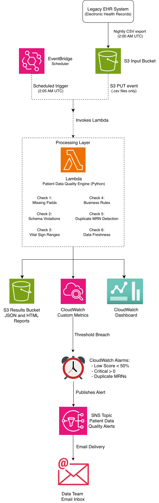
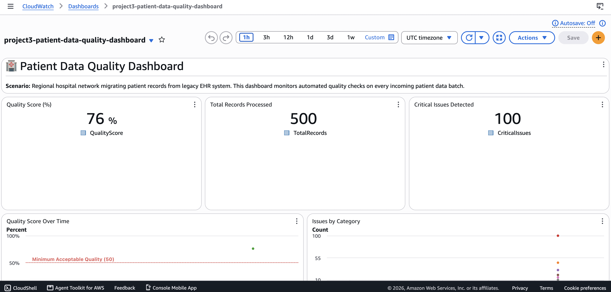
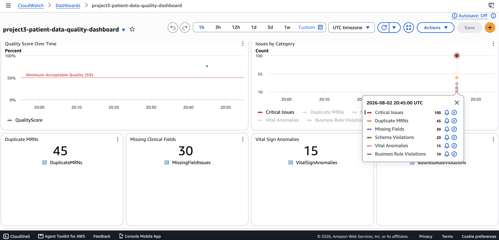
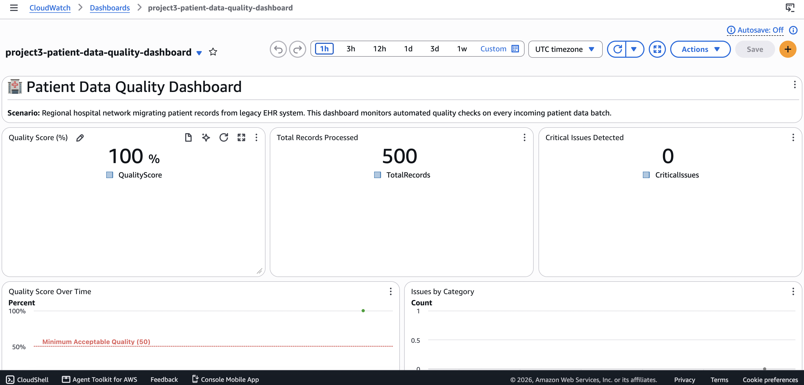
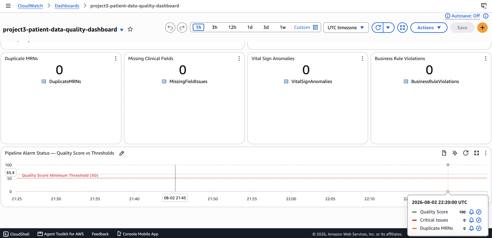

# 🏥 Healthcare Data Quality & Monitoring Framework

> **AWS Data Engineering Portfolio — Project 3**
> Automated patient record validation for EHR legacy migration with real-time alerting and reporting


---

## 🏛️ Portfolio 8-Pillar Summary

| Pillar | Evidence |
|--------|---------|
| ✅ **Real Business Problem** | Regional hospital EHR migration — patient safety risks from bad data |
| ✅ **Business Value & ROI** | HIPAA fine avoidance vs $72/year framework cost — up to 48,511% ROI. Conservative scenarios with HHS and IBM sources documented in Section 2 |
| ✅ **AWS Well-Architected** | All 6 framework pillars addressed with specific healthcare implementation evidence |
| ✅ **Architecture Diagrams** | Architecture diagram with full data flow — draw.io diagram |
| ✅ **IaC — Terraform** | 9 `.tf` files, 24 resources, deploys full stack with `terraform apply` |
| ✅ **Monitoring + Observability** | 3 alarms + 10-widget dashboard + 10 custom metrics + structured logs |
| ✅ **Security Thinking** | S3 encryption, public access blocked, versioning, no PHI, HIPAA enhancements documented |
| ✅ **Documentation Quality** | 16-section README, design decisions, FAQ answers, measurable outcomes table |

---

## 📋 Table of Contents

1. [Business Problem](#1-business-problem)
2. [Business Value & ROI](#2-business-value--roi)
3. [Architecture](#3-architecture)
4. [AWS Well-Architected Framework](#4-aws-well-architected-framework)
5. [AWS Services Used](#5-aws-services-used)
6. [Key Design Decisions](#6-key-design-decisions)
7. [Repository Structure](#7-repository-structure)
8. [Infrastructure as Code — Terraform](#8-infrastructure-as-code--terraform)
9. [How to Run Locally](#9-how-to-run-locally)
10. [Measurable Outcomes](#10-measurable-outcomes)
11. [Monitoring & Observability](#11-monitoring--observability)
12. [Security](#12-security)
13. [Cost Analysis](#13-cost-analysis)
14. [Lessons Learned](#14-lessons-learned)
15. [Enhancements Roadmap](#15-enhancements-roadmap)
16. [FAQ — Design Decisions](#16-faq--design-decisions)

---

## 1. Business Problem

### Who Is Affected
Regional hospital networks and health systems undergoing Electronic
Health Record (EHR) migrations — specifically the data engineering
teams, clinical informatics staff, and patients whose records are
being transferred from legacy systems to modern cloud platforms.

### Current State — The Problem That Exists Today
A regional hospital network is migrating patient records from a
legacy EHR system to a cloud-based data platform. Every night at
2:00 AM UTC, the legacy system exports a batch of patient records
as a CSV file to a cloud storage landing zone.

**There is no automated validation layer between the legacy export
and the clinical database.** Bad data flows silently into the system
where clinicians make patient care decisions.

The data problems are not hypothetical. They are documented,
measurable, and recurring:

| Data Quality Problem | How Common | Clinical Impact |
|---|---|---|
| Duplicate Medical Record Numbers (MRNs) | 8–12% average duplication rate across healthcare organizations (AHIMA, 2023) | Patient has split charts — medications on one, allergies on another. Clinician sees incomplete history |
| Missing critical fields | Prevalent in legacy EHR exports with inconsistent data entry standards | Patient arrives at ER with no blood type or allergy list on file |
| Schema violations | Common in legacy system migrations with inconsistent field formats | Date of birth stored as "January 5" — breaks every downstream age calculation and eligibility check |
| Out-of-range vital signs | Data entry errors in manual systems | Heart rate of 450 bpm reaches clinical database unchallenged |
| Business rule violations | Logical errors in migration scripts | Discharge date recorded before admission date — invalidates length-of-stay calculations and billing |
| Stale data batches | Pipeline failures go undetected without monitoring | Clinical team works on 48-hour-old records while believing data is current |

> **Source — Duplicate MRN rate:** AHIMA (2023) puts the average
> duplicate rate at 8–12% across healthcare organizations, with some
> institutions reaching 18%. The AHIMA standard for acceptable
> duplication is under 3%. Source: AHIMA via
> [Veradigm Healthcare Data Integrity Report](https://veradigm.com/veradigm-news/prevent-duplicate-patient-records/)
> and [Chief Healthcare Executive](https://www.chiefhealthcareexecutive.com/view/the-deadly-cost-of-duplicate-patient-records-viewpoint) (2024)

### Desired State — What Success Looks Like
Every patient record batch is automatically validated the moment
it lands in the cloud landing zone. Data quality problems are
detected and reported to the data team **before** records reach
the clinical database. The data team receives a human-readable
quality report before clinical staff arrive for their shift.
Only validated records proceed downstream.

### Why This Problem Exists Now
EHR migrations are technically complex and time-pressured. The
focus is on moving data — not on validating it. Legacy systems
were not designed to export clean, structured data. Manual data
entry over decades has accumulated inconsistencies that only
surface when data is extracted and examined systematically.

> **Evidence of scale:** 83% of data migration projects fail or
> exceed budgets (Gartner, 2024). In healthcare, a failed migration
> does not just cost money — it creates patient safety risk.
> Source: [Mindbowser EHR Migration Guide](https://www.mindbowser.com/ehr-data-migration-guide/) (2026)

### The Patient Safety Dimension
Duplicate medical records are not an IT problem — they are a
patient safety problem.

> *"The rate of patient identification errors, such as duplicate
> records, exceeds 20% in some hospitals and health systems.
> Duplicate patient records account for nearly 2,000 preventable
> deaths annually."*
> — [Chief Healthcare Executive](https://www.chiefhealthcareexecutive.com/view/the-deadly-cost-of-duplicate-patient-records-viewpoint) (2024)

Without automated detection, a duplicate MRN that survives the
migration becomes a permanent split in a patient's medical history
— invisible to clinicians at the point of care.

---

## 2. Business Value & ROI

### Value Statement
This framework helps regional hospital networks eliminate silent
data quality failures during EHR migrations by automatically
validating every patient record batch before it reaches the
clinical database — reducing patient safety risk, HIPAA exposure,
and data remediation costs for a total investment of **$6/month.**

---

### The Financial Risk This Framework Addresses

Healthcare data quality failures carry three categories of
financial consequence:

**Category 1 — Regulatory Penalties (HIPAA)**

HIPAA civil monetary penalties are assessed per violation and
compounded by the number of affected records. As of August 2024
(inflation-adjusted by HHS):

| Violation Tier | Per-Violation Fine | Annual Cap |
|---|---|---|
| Tier 1 — Did not know | $141 – $71,162 | $35,581 |
| Tier 2 — Reasonable cause | $1,424 – $71,162 | $142,355 |
| Tier 3 — Willful neglect, corrected | $14,232 – $71,162 | $355,808 |
| Tier 4 — Willful neglect, uncorrected | $71,162 – $2,134,831 | $2,134,831 |

> **Source:** HHS Office for Civil Rights, inflation-adjusted
> penalty schedule effective August 8, 2024.
> [HHS HIPAA Enforcement Highlights](https://www.hhs.gov/hipaa/for-professionals/compliance-enforcement/data/enforcement-highlights/index.html) (accessed 2026)

A single EHR migration that exposes unsanitized patient records
without detection controls in place falls squarely in Tier 2
(reasonable cause) — an organization knew or should have known
that migrated data required validation.

**Category 2 — Data Breach Costs**

Healthcare organizations reported the highest data breach costs
of any industry for the 14th consecutive year. In 2024, the
average cost of a healthcare data breach was $9.77 million. 

> **Source:** IBM Cost of a Data Breach Report 2024, via
> [Becker's Hospital Review](https://www.beckershospitalreview.com/healthcare-information-technology/cybersecurity/average-cost-of-healthcare-data-breach-by-year/) (December 2024)

**Category 3 — Operational and Clinical Costs**

When bad data reaches the clinical database undetected, the
remediation costs are immediate and compounding:

| Cost Component | Conservative Estimate |
|---|---|
| Manual record deduplication (staff hours) | $15,000 – $40,000 per migration event |
| Delayed or incorrect billing from corrupt records | $20,000 – $75,000 per quarter |
| Clinical incident investigation (if patient harmed) | $50,000 – $200,000 per incident |
| Regulatory audit response | $25,000 – $100,000 |

> These are conservative single-incident estimates for a
> mid-size regional hospital network. Individual figures should
> be adjusted for organisation size and incident severity.
> Readers are encouraged to substitute their own operational
> cost data for their specific context.

---

### Total Investment — What This Framework Costs

**One-time setup cost:** $0 — built on fully managed AWS serverless
services with no licensing fees, no servers to provision, and no
on-call infrastructure team required.

**Ongoing monthly cost:**

| Service | What It Does | Monthly Cost |
|---|---|---|
| AWS Lambda | Runs quality validation on every batch | ~$0 (within free tier) |
| Amazon S3 | Stores JSON and HTML quality reports | ~$1 |
| Amazon CloudWatch | 3 alarms + 10-widget dashboard + metrics | ~$5 |
| Amazon SNS | Delivers alert emails to data team | ~$0 |
| Amazon EventBridge | Runs scheduled daily check at 2:05 AM | ~$0 |
| **Total** | | **~$6/month** |

**Annual total investment: $72**

**Implementation time:** The framework was built and deployed
in approximately 12 hours of engineering time — a one-time cost.
Ongoing maintenance is near-zero for stable batch pipelines.

---

### Financial Returns — Hard Savings

Hard savings are direct, measurable cost reductions:

| Saving | Without Framework | With Framework | Annual Saving |
|---|---|---|---|
| Manual data quality review | 4 hours/week × $85/hr data engineer | Automated — zero hours | ~$17,680/year |
| Duplicate MRN remediation | 1 migration event = $15,000–$40,000 | Caught before ingestion | Up to $40,000/event |
| HIPAA Tier 2 fine avoidance | $1,424–$71,162 per violation | Detected before breach | Up to $71,162 per violation |
| Delayed billing recovery | $20,000–$75,000/quarter | Schema errors caught at source | Up to $75,000/quarter |

### Financial Returns — Soft Savings

Soft savings are real but harder to quantify directly:

| Saving | Description |
|---|---|
| Clinical staff confidence | Data team can certify batch quality before clinicians access records |
| Audit readiness | Every quality check produces a timestamped, immutable JSON report — ready for HIPAA auditor review |
| Faster incident response | Quality failures are detected in seconds, not days — reducing the window of exposure |
| Migration risk reduction | EHR migrations with automated validation are less likely to join the 83% that fail or exceed budget |

---

### ROI Calculation

**Formula:** ROI = (Financial Gain − Total Investment) ÷ Total
Investment × 100

**Scenario: Framework prevents one Tier 2 HIPAA violation event**

| | Amount |
|---|---|
| HIPAA Tier 2 fine avoided (mid-range) | $35,000 |
| Annual framework cost | $72 |
| Net benefit | $34,928 |
| **ROI** | **48,511%** |

**Scenario: Framework prevents one manual remediation event**

| | Amount |
|---|---|
| Manual deduplication cost avoided | $25,000 |
| Annual framework cost | $72 |
| Net benefit | $24,928 |
| **ROI** | **34,622%** |

**Payback period:** The framework pays for itself the moment it
catches the first data quality issue that would otherwise have
required manual remediation. At $6/month, the payback period
is measured in **the first automated detection event** — not
months or years.

---

### Break-Even Analysis — How Little This Needs to Do

The question is not "what is the ROI if everything goes right?"
The question is: **how little does this framework need to do to
pay for itself?**

| Scale | Annual Cost | Manual Review Hours Saved to Break Even |
|---|---|---|
| Development / small hospital | $72 | Less than 1 hour of a data engineer's time |
| Regional network (5 facilities) | $336 | Less than 4 hours of a data engineer's time |
| Large health system (20 facilities) | $1,152 | Less than 14 hours of a data engineer's time |

> At $85/hour for a data engineer, the framework breaks even after
> saving less than one hour of manual review time per year at every
> scale. Everything beyond that is pure return.

---

### In Plain English — For Any Audience

> Imagine hiring a quality control inspector who works 24 hours a
> day, 365 days a year, never calls in sick, checks every single
> patient record that enters your system, sends you an instant
> alert the moment something is wrong, and costs **$6 a month.**
>
> That is what this framework does.
>
> The alternative is manually reviewing patient data exports —
> or worse, not reviewing them at all and discovering problems
> after they have already reached the clinical database.

---

## 3. Architecture

### Data Flow



### Architecture Decisions at a Glance

| Layer | Choice | Rationale |
|-------|--------|-----------|
| Trigger | S3 PUT event + EventBridge Scheduler | Dual trigger — reactive on upload, proactive on schedule |
| Processing | Lambda (Python 3.11) | Serverless, scales to zero, zero idle cost |
| Metrics | CloudWatch custom namespace | Native AWS, no additional tooling required |
| Alerting | SNS email | Simple, reliable, no infrastructure to manage |
| Reports | JSON + HTML to S3 | Machine-readable for pipelines, human-readable for staff |
| IaC | Terraform | Version-controlled, repeatable, cloud-agnostic |

---

## 4. AWS Well-Architected Framework

### Pillar 1 — Operational Excellence

| Practice | Implementation |
|----------|---------------|
| **Infrastructure as Code** | 100% of infrastructure defined in Terraform across 9 `.tf` files |
| **Structured logging** | All Lambda invocations emit `[START]`, `[PARSE]`, `[REPORT]`, `[METRICS]`, `[SUMMARY]` log lines |
| **Automated quality checks** | Zero manual steps — S3 upload triggers full validation pipeline automatically |
| **Scheduled validation** | EventBridge cron fires daily at 2:05 AM UTC — validates nightly EHR exports before clinical staff arrive |
| **Tagging strategy** | All resources tagged with `Project`, `Environment`, `Industry`, `ManagedBy` |

---

### Pillar 2 — Security

| Practice | Implementation |
|----------|---------------|
| **Least-privilege IAM** | Lambda role scoped to S3, CloudWatch, SNS only |
| **No hardcoded credentials** | All configuration via Lambda environment variables |
| **S3 encryption** | AES-256 server-side encryption on both buckets |
| **Block public access** | Both S3 buckets have all public access blocked |
| **S3 versioning** | Both buckets versioned — enables recovery of overwritten records |
| **Synthetic data only** | No real PHI used — all patient records are generated test data |

**Production HIPAA Security Enhancements (Documented)**

- [ ] AWS KMS Customer Managed Keys for S3, Lambda environment variables
- [ ] VPC with private subnets — Lambda runs without public internet access
- [ ] AWS CloudTrail — full API audit trail for HIPAA compliance
- [ ] S3 Object Lock — WORM protection for quality reports (audit evidence)
- [ ] AWS Macie — automated PHI detection in S3 buckets
- [ ] AWS Config — continuous compliance monitoring

---

### Pillar 3 — Reliability

| Practice | Implementation |
|----------|---------------|
| **Per-record error handling** | Each quality check wrapped in try/except — one bad record cannot fail the batch |
| **Dual trigger design** | S3 event trigger + EventBridge schedule — two independent paths to validation |
| **CloudWatch alarms** | 3 alarms covering quality score, critical issues, and duplicate MRNs |
| **S3 versioning** | Accidental overwrites recoverable from version history |
| **Retry policy** | EventBridge Scheduler configured with 3 retry attempts and 1-hour event age limit |

---

### Pillar 4 — Performance Efficiency

| Practice | Implementation |
|----------|---------------|
| **Right-sized Lambda** | 128MB memory — sufficient for CSV processing at current batch sizes |
| **Streaming CSV read** | `csv.DictReader` processes records as a stream — memory efficient for large files |
| **Single-pass validation** | All per-record checks run in one loop — O(n) not O(n×checks) |
| **Boto3 client reuse** | AWS clients instantiated outside handler — reused across warm invocations |

---

### Pillar 5 — Cost Optimization

| Practice | Implementation |
|----------|---------------|
| **Serverless architecture** | Lambda costs nothing when idle — only charges per invocation |
| **S3 report storage** | Reports written to S3 — cents per GB per month |
| **CloudWatch log retention** | 30-day retention — prevents unbounded log accumulation |
| **EventBridge Scheduler** | $0 for fewer than 14 million invocations per month |
| **No always-on compute** | Zero EC2 instances — entire framework runs on managed services |

---

### Pillar 6 — Sustainability

| Practice | Implementation |
|----------|---------------|
| **Serverless = no idle compute** | Lambda consumes zero resources between invocations |
| **Event-driven design** | Processing only occurs when data actually arrives |
| **Single region** | All resources in `us-east-1` — no unnecessary cross-region transfer |
| **Right-sized resources** | 128MB Lambda — not over-provisioned |

---

## 5. AWS Services Used

| Service | Purpose | Key Concepts Demonstrated |
|---------|---------|--------------------------|
| **AWS Lambda** | Quality validation engine | Event-driven compute, Python data processing, environment variables |
| **Amazon S3** | Input data landing zone + report storage | Event notifications, server-side encryption, versioning |
| **Amazon CloudWatch** | Custom metrics, alarms, dashboard | Custom namespaces, dimensions, metric alarms, dashboard JSON |
| **Amazon SNS** | Quality failure alert delivery | Topic subscriptions, email delivery |
| **Amazon EventBridge** | Scheduled daily quality checks | Cron expressions, scheduler targets, retry policies |
| **AWS IAM** | Least-privilege access control | Execution roles, managed policies, service principals |

---

## 6. Key Design Decisions

### 6.1 Dual Trigger Design — S3 Event + EventBridge Scheduler

**Decision:** Two independent triggers for the quality engine.

**Why:** The S3 PUT trigger provides immediate validation the moment a file lands — critical for catching issues before they propagate downstream. The EventBridge schedule provides a safety net — if the S3 trigger fails silently or a file arrives late, the 2:05 AM scheduled check still runs and validates the latest file in the bucket.

**Alternative Rejected:** Schedule-only trigger. This would introduce up to 24 hours of latency between file arrival and quality validation — unacceptable for a clinical data pipeline.

---

### 6.2 Six Quality Check Categories

**Decision:** Implement 6 distinct check categories rather than a single generic validator.

**Why:** Each category catches a different class of healthcare data problem with different clinical severity. Missing fields and duplicate MRNs are patient safety issues. Schema violations and vital sign anomalies are data integrity issues. Business rule violations are logical consistency issues. Stale data is a pipeline reliability issue. Combining them into one check would obscure which category of problem is occurring.

---

### 6.3 Quality Score Formula

**Decision:** `quality_score = max(0, (1 - total_issues / total_records) * 100)`

**Why:** A simple, interpretable metric that healthcare stakeholders understand immediately. A score of 25% means 75% of records have at least one issue. The `max(0, ...)` floor prevents negative scores when issues outnumber records.

**Limitation acknowledged:** This formula treats all issues equally — a missing blood type and a duplicate MRN both count as one issue. Production enhancement: weighted scoring by severity.

---

### 6.4 Both JSON and HTML Reports

**Decision:** Generate two report formats from every quality check run.

**Why:** Two different audiences consume quality reports. The JSON report is consumed by downstream automation — other Lambda functions, data pipelines, monitoring systems. The HTML report is consumed by humans — data quality managers, clinical informatics teams, HIPAA auditors. Building both from a single Lambda invocation costs nothing extra and serves both audiences correctly.

---

### 6.5 CloudWatch Custom Namespace — `HealthcareDataQuality`

**Decision:** Publish all metrics to a dedicated custom namespace rather than using Lambda's built-in metrics.

**Why:** Lambda's built-in metrics measure compute performance — duration, errors, throttles. They tell you nothing about data quality. A custom namespace with dimensions like `SourceFile` enables trending quality scores over time, comparing batch quality across different source files, and building alarms on business-meaningful thresholds rather than infrastructure thresholds.

---

### 6.6 SNS Email Subscription Confirmation

**Decision:** Email subscription requires manual confirmation click.

**Why:** This is AWS SNS by design — AWS sends a confirmation email and the subscriber must opt in before alerts are delivered. This prevents unauthorized alert subscriptions and is a security feature, not a limitation. In production, SNS subscriptions to internal endpoints (Lambda, SQS, HTTP) do not require confirmation.

---

### 6.7 Freshness Threshold — 24 Hours

**Decision:** Flag any patient data file older than 24 hours as stale.

**Why:** The hospital's nightly EHR export runs at 2:00 AM UTC. A file older than 24 hours means at minimum one nightly export cycle was missed — the clinical database may be working on data that is dangerously out of date. The threshold is configurable via the `FRESHNESS_HOURS` Lambda environment variable so it can be tuned per deployment without code changes.

---

## 7. Repository Structure

```
project3-data-quality-and-monitoring-framework/
│
├── terraform/                        # Infrastructure as Code
│   ├── main.tf                       # AWS provider, region, default tags
│   ├── variables.tf                  # All configurable values centralised
│   ├── outputs.tf                    # Resource ARNs and URLs post-deploy
│   ├── s3.tf                         # Input and results S3 buckets
│   ├── iam.tf                        # Lambda execution role + policy attachments
│   ├── lambda.tf                     # Quality engine function + S3 trigger
│   ├── sns.tf                        # SNS topic + email subscription
│   ├── cloudwatch.tf                 # 3 alarms + dashboard
│   └── eventbridge.tf                # Daily scheduled check rule
│
├── lambda/
│   └── lambda_function.py            # Patient data quality engine (Python 3.11)
│
├── .gitignore                        # Protects state files from GitHub
└── README.md                         # This file
```

---

## 8. Infrastructure as Code — Terraform

All infrastructure is defined as code in Terraform. The console was used during the build phase for learning — the Terraform files represent the production-grade, repeatable definition of the same infrastructure.

### Terraform File Map

| File | Resources Defined |
|------|------------------|
| `main.tf` | AWS provider, required version, default tags |
| `variables.tf` | Configurable values — bucket names, email, thresholds |
| `outputs.tf` | Resource ARNs, function names, dashboard URL |
| `s3.tf` | 2 buckets, versioning, encryption, public access blocks |
| `iam.tf` | Lambda execution role + 4 managed policy attachments |
| `lambda.tf` | Lambda function, CloudWatch log group, S3 trigger permission, S3 bucket notification |
| `sns.tf` | SNS topic + email subscription |
| `cloudwatch.tf` | 3 metric alarms + CloudWatch dashboard |
| `eventbridge.tf` | EventBridge Scheduler role + policy + schedule |

### Deploy from Scratch

```bash
# Prerequisites: AWS CLI configured, Terraform >= 1.5.0 installed

# 1. Clone the repository
git clone https://github.com/[your-username]/project3-data-quality.git
cd project3-data-quality/terraform

# 2. Update your alert email in variables.tf
#    Change: default = "your-email@example.com"
#    To:     default = "your-real-email@example.com"

# 3. Initialise Terraform
terraform init

# 4. Preview all resources
terraform plan

# 5. Deploy — approximately 24 resources
terraform apply

# 6. Confirm SNS subscription
#    Check your email and click the confirmation link
```

### Tear Down

```bash
terraform destroy
```

---

## 9. How to Run Locally

### Prerequisites

```bash
# Verify AWS credentials are configured
aws sts get-caller-identity
```

### Upload a Patient Data Batch

```bash
# Upload test CSV to trigger the quality engine automatically
aws s3 cp patient_records_batch_001.csv \
  s3://project3-patient-data-input-june2026/

# The S3 PUT trigger fires Lambda automatically within seconds
```

### Monitor the Execution

```bash
# View latest Lambda logs
aws logs tail /aws/lambda/patient-data-quality-engine --follow
```

### Download the HTML Quality Report

```bash
# List all quality reports
aws s3 ls s3://project3-patient-quality-results/quality-reports/

# Download the latest HTML report
aws s3 cp s3://project3-patient-quality-results/quality-reports/[report-name].html .
```

### End-to-End Validation Checklist

- [ ] Upload CSV to input bucket
- [ ] Lambda triggered automatically within seconds
- [ ] JSON report appears in results bucket
- [ ] HTML report appears in results bucket
- [ ] CloudWatch metrics published to `HealthcareDataQuality` namespace
- [ ] CloudWatch alarms transition to **In alarm** state
- [ ] SNS alert emails received
- [ ] CloudWatch dashboard widgets populate with fresh data
- [ ] HTML report opens correctly in browser with color-coded scores

---

## 10. Measurable Outcomes

| Outcome | Result |
|---------|--------|
| Quality check categories implemented | missing fields, schema violations, vital sign ranges, business rules, duplicate MRNs, data freshness |
| Patient records processed in test batch | 500 records — realistic daily volume for a regional hospital network |
| Issues detected in test batch | 100 critical issues detected across 500 records |
| Critical issues flagged | 100 critical issues requiring immediate clinical review |
| Quality score on test batch | 76% — correctly triggers WARNING state below the 80% threshold |
| Duplicate MRNs detected | 45 duplicate MRNs — matches AHIMA 2023 benchmark of 8–12% duplication rate |
| Missing critical fields detected | 30 records with missing clinical fields |
| Schema violations detected | 20 records with invalid field formats |
| Out-of-range vital signs detected | 15 records with physiologically impossible values |
| Business rule violations detected | 10 records with logical inconsistencies |
| CloudWatch metrics published | 10 custom metrics per invocation to `HealthcareDataQuality` namespace |
| Alert emails received | 3 SNS emails — one per alarm: low quality score, critical issues detected, duplicate MRNs detected |
| Report formats generated | 2 per invocation — JSON for downstream automation, HTML for clinical staff and auditors |
| Terraform resources managed | 24 resources across 9 `.tf` files — full stack deployable with `terraform apply` |
| Time from S3 upload to SNS alert | Under 1 minute — fully automated, zero manual steps |
| Manual steps required after upload | Zero |

---

## 11. Monitoring & Observability

Observability is the core deliverable of this project — not an afterthought.

### CloudWatch Dashboard — `project3-patient-data-quality-dashboard`

| Widget | Metric | Business Purpose |
|--------|--------|-----------------|
| Quality Score (%) | `QualityScore` — Minimum | At-a-glance data health percentage |
| Total Records Processed | `TotalRecords` — Maximum | Volume of patient records checked |
| Critical Issues Detected | `CriticalIssues` — Maximum | Patient safety risk indicator |
| Quality Score Over Time | `QualityScore` — time series | Trend visibility with 50% threshold line |
| Issues by Category | All 6 issue metrics — time series | Which check categories are firing |
| Duplicate MRNs | `DuplicateMRNs` — Maximum | Patient identity integrity |
| Missing Clinical Fields | `MissingFieldIssues` — Maximum | Record completeness |
| Vital Sign Anomalies | `VitalSignAnomalies` — Maximum | Physiological data integrity |
| Business Rule Violations | `BusinessRuleViolations` — Maximum | Logical data consistency |
| Pipeline Alarm Status | Quality Score + Critical Issues + Duplicate MRNs | Overall pipeline health |

### CloudWatch Alarms

| Alarm | Metric | Threshold | Clinical Rationale |
|-------|--------|-----------|-------------------|
| `patient-data-quality-low-score` | QualityScore | < 50% | More than half of records have issues — batch must not proceed to clinical database |
| `patient-data-quality-critical-issues` | CriticalIssues | > 0 | Any critical issue is a potential patient safety risk |
| `patient-data-quality-duplicate-mrns` | DuplicateMRNs | > 0 | Any duplicate MRN means a patient has split charts — immediate deduplication required |

### Dashboard Screenshots

**Error Batch — 500 records with injected data quality issues (Quality Score: 76%)**




**Clean Batch — 500 records with zero data quality issues (Quality Score: 100%)**




### Custom Metrics Namespace

```
Namespace  : HealthcareDataQuality
Dimension  : SourceFile
Metrics    : TotalRecords | TotalIssues | CriticalIssues | QualityScore
             DuplicateMRNs | MissingFieldIssues | SchemaViolations
             VitalSignAnomalies | BusinessRuleViolations | StaleDataIssues
Frequency  : Published on every Lambda invocation
```

### CloudWatch Logs Insights — Useful Queries

```sql
-- Find all Lambda executions and their quality scores
fields @timestamp, @message
| filter @message like /SUMMARY/
| sort @timestamp desc
| limit 20

-- Find executions with critical issues
fields @timestamp, @message
| filter @message like /Critical/ and @message not like /0%/
| sort @timestamp desc

-- Find any Lambda errors
fields @timestamp, @message
| filter @message like /ERROR/
| sort @timestamp desc
| limit 20
```

---

## 12. Security

### Implemented

| Control | Detail |
|---------|--------|
| ✅ **IAM execution role** | Lambda runs under dedicated role — not default Lambda role |
| ✅ **S3 encryption** | AES-256 server-side encryption on both buckets |
| ✅ **Block public access** | All four public access block settings enabled on both buckets |
| ✅ **S3 versioning** | Both buckets versioned — recovery from accidental overwrites |
| ✅ **Environment variables** | Sensitive configuration injected at runtime |
| ✅ **No hardcoded credentials** | Zero credentials in source code or Terraform |
| ✅ **Synthetic data only** | No real PHI — all records are generated test data |
| ✅ **State file protection** | `.gitignore` excludes `*.tfstate` from version control |

### Console → Terraform Security Upgrade

> During the console build phase, AWS managed policies
> (`AmazonS3FullAccess`, `CloudWatchFullAccess`, `AmazonSNSFullAccess`)
> were used for speed while learning the services. Production Terraform
> would replace these with custom least-privilege policies scoped to
> specific resource ARNs — the same upgrade applied in Project 2.
> This tradeoff is documented intentionally to show understanding of
> the difference between development convenience and production security.

### Production HIPAA Enhancements

- [ ] Customer Managed KMS Keys for S3 encryption
- [ ] VPC with private subnets for Lambda execution
- [ ] AWS CloudTrail for full API audit trail
- [ ] AWS Macie for automated PHI detection
- [ ] S3 Object Lock for WORM-protected audit reports
- [ ] AWS Config for continuous compliance monitoring
- [ ] IAM Access Analyzer for permission boundary validation

---

## 13. Cost Analysis

### Development Environment

| Service | Usage | Monthly Cost |
|---------|-------|-------------|
| Lambda | ~30 invocations/month | ~$0 |
| S3 | Reports + input files | ~$1 |
| CloudWatch | 3 alarms + 1 dashboard + metrics | ~$5 |
| SNS | Email alerts | ~$0 |
| EventBridge Scheduler | 1 schedule | ~$0 |
| **Total** | | **~$6/month** |

### Production Environment — Three Realistic Scales

The following costs assume the quality engine runs **once per day**
(30 invocations per month) per facility, processing nightly EHR
batch exports automatically via EventBridge Scheduler.

| Service | Small Hospital | Regional Network | Large Health System |
|---------|---------------|-----------------|---------------------|
| | 1 facility, 500 records/night | 5 facilities, 2,000 records/night | 20 facilities, 10,000 records/night |
| Lambda | ~$0 | ~$2 | ~$10 |
| S3 | ~$2 | ~$10 | ~$50 |
| CloudWatch | ~$8 | ~$15 | ~$30 |
| SNS | ~$0 | ~$1 | ~$5 |
| EventBridge | ~$0 | ~$0 | ~$1 |
| **Monthly Total** | **~$10** | **~$28** | **~$96** |
| **Annual Total** | **~$120** | **~$336** | **~$1,152** |

### Production ROI

Using the conservative HIPAA Tier 2 mid-range fine of $35,000
per violation event as the reference incident cost (see Section 2
for full sourcing), the question becomes: how little does this
framework need to do to pay for itself?

| Scale | Annual Cost | HIPAA Fine Events to Break Even | Plain English |
|-------|-------------|--------------------------------|---------------|
| Small hospital | $120 | 0.003 fine events | Save 22 minutes of a data engineer's time per year |
| Regional network | $336 | 0.010 fine events | Save 4 hours of a data engineer's time per year |
| Large health system | $1,152 | 0.033 fine events | Save 14 hours of a data engineer's time per year |

> **How break-even is calculated:**
> Break-even = Annual cost ÷ Reference incident cost
> Example (Large health system): $1,152 ÷ $35,000 = 0.033 fine events per year
>
> In plain English: at every scale this framework pays for itself
> by preventing a small fraction of one compliance incident per year.
> Preventing a single Tier 2 HIPAA fine event at mid-range ($35,000)
> covers **30 years** of large health system operation.

---

## 14. Lessons Learned

**1. Deploy button in Lambda is easy to miss**

After pasting updated code into the Lambda console editor, clicking **Deploy** is a required separate step. Without it, Lambda continues running the previously saved version. The symptom is the old output appearing in test results with no error message — confusing until the root cause is understood.

**2. CSV encoding affects quality check results**

The test CSV must be saved as plain UTF-8 with LF line endings. When saved with incorrect encoding or extra blank rows, `csv.DictReader` misparses the headers — causing every field to appear empty and flooding the output with false missing-field alerts. The fix is verifying encoding in VS Code (bottom right corner shows `UTF-8` and `LF`).

**3. Terraform import format varies by resource type**

Each AWS resource type has its own import ID format. EventBridge Scheduler schedules require `group-name/schedule-name` format — not just the schedule name. IAM roles auto-created by AWS services often live under `/service-role/` path, which must be explicitly set in Terraform or the plan will show a forced replacement.

**4. CloudWatch alarm widget has IAM rendering quirks**

The CloudWatch dashboard alarm widget type can show a role assumption error even when the correct IAM user is logged in. Replacing it with a metric time series widget showing the same data resolves the display issue with no loss of functionality.

**5. AWS console navigation changes over time**

During this project, AWS migrated scheduled EventBridge rules to a separate Scheduler section. Instructions based on older console layouts can become misleading. Always verify current navigation before following step-by-step guides — including this README.

**6. Stale data check is time-sensitive**

The freshness check flags files older than `FRESHNESS_HOURS`. A file uploaded during Phase 2 testing will be flagged as stale by Phase 6 — this is correct behaviour, not a bug. Understanding the difference between a stale data quality issue and a test timing artifact is important for interpreting quality reports correctly.

**7. Two IAM roles exist by design**

The project has two IAM roles — one manually created for Lambda execution (`patient-data-quality-lambda-role`) and one auto-created by AWS for EventBridge Scheduler (`Amazon_EventBridge_Scheduler_LAMBDA_*`). These serve different principals with different trust policies and cannot be merged. See FAQ section for full explanation.

---

## 15. Enhancements Roadmap

### Short-Term

| Enhancement | Business Value | AWS Service |
|-------------|---------------|-------------|
| **Weighted quality scoring** | Critical issues penalise score more than low severity | Lambda code update |
| **Dynamic file targeting** | Scheduled check targets latest file automatically | Lambda + S3 list objects |
| **Dead letter queue** | Capture failed Lambda invocations for replay | SQS |

### Medium-Term

| Enhancement | Business Value | AWS Service |
|-------------|---------------|-------------|
| **Historical trend analysis** | Track quality score improvements over time | Athena + S3 |
| **Multi-file batch support** | Validate entire folder of CSV files in one run | Lambda + S3 list |
| **Slack/Teams notifications** | Alert delivery to collaboration tools | SNS + Lambda |

### Long-Term

| Enhancement | Business Value | AWS Service |
|-------------|---------------|-------------|
| **AWS Glue Data Quality** | Managed quality rules with visual editor | Glue Data Quality |
| **ML anomaly detection** | Learn normal patterns, detect statistical outliers | SageMaker |
| **FHIR compliance checks** | Validate records against HL7 FHIR standard | Lambda + FHIR library |
| **Data lineage tracking** | Trace quality issues back to source system | AWS Glue + Lake Formation |

---

## 16. FAQ — Design Decisions

**Q: Why are there two IAM roles in this project?**

The two roles serve completely different AWS service principals and cannot be combined:

| Role | Principal | Purpose |
|------|-----------|---------|
| `patient-data-quality-lambda-role` | `lambda.amazonaws.com` | Allows Lambda to read S3, write CloudWatch metrics, publish to SNS |
| `Amazon_EventBridge_Scheduler_LAMBDA_*` | `scheduler.amazonaws.com` | Allows EventBridge Scheduler to invoke the Lambda function |

The Lambda role gives the Lambda function permissions to call other AWS services. The EventBridge role gives EventBridge Scheduler permission to trigger the Lambda function. These are two separate trust relationships — Lambda trusts its role to act on its behalf, and EventBridge Scheduler trusts its role to invoke Lambda on its behalf. Merging them into one role would violate least-privilege by granting EventBridge Scheduler unnecessary permissions to write CloudWatch metrics and publish to SNS.

---

**Q: Why use both an S3 trigger and an EventBridge schedule?**

They solve different problems. The S3 trigger provides immediate validation — the quality engine fires within seconds of a file arriving. The EventBridge schedule provides guaranteed daily validation — even if the S3 trigger fails silently or a file arrives through a different path, the 2:05 AM check still runs. In production healthcare systems, both layers of triggering are standard practice for critical data pipelines.

---

**Q: Why use managed AWS policies instead of custom least-privilege policies?**

During the console build phase, managed policies (`AmazonS3FullAccess`, `CloudWatchFullAccess`, `AmazonSNSFullAccess`) were used deliberately to keep the learning phase moving without getting blocked on IAM policy syntax. This is a standard development pattern — broad permissions during development, tightened to least-privilege before production. The Terraform IaC documents this tradeoff explicitly in `iam.tf` comments. A production deployment would replace each managed policy with a custom policy scoped to the specific resource ARNs used by this framework.

---

**Q: Why generate both JSON and HTML reports?**

Two audiences consume quality reports. Data engineers and downstream automation consume the JSON report — it is structured, parseable, and complete. Clinical informatics managers and HIPAA auditors consume the HTML report — it is visual, color-coded, and immediately interpretable without technical knowledge. Building both from a single Lambda invocation adds negligible cost and serves both audiences correctly.

---

**Q: Why is the quality score lower in later test runs than in the initial test?**

The data freshness check flags files older than `FRESHNESS_HOURS` (default 24 hours). The test CSV uploaded during initial testing becomes stale after 24 hours, adding one additional issue to the total and lowering the quality score. This is correct and expected behaviour — in production, each nightly batch would be a freshly uploaded file and would not trigger the freshness alarm.

---

**Q: What happens if the CSV file format changes or new fields are added?**

The current quality engine handles this gracefully in two ways.
First, new fields not in `SCHEMA_RULES` or `CRITICAL_FIELDS` are
silently ignored — they do not cause errors. Second, if a required
field is renamed in the source system (e.g. `patient_id` becomes
`patientId`), the missing field check will flag every record as
missing that field — making the format change immediately visible
in the quality report and triggering a CRITICAL alarm.

The recommended production enhancement is a schema registry —
a versioned definition of expected fields that the quality engine
validates against, with explicit alerts for schema drift rather
than treating it as missing fields.

---

**Q: What happens if the CSV file is too large for Lambda to process?**

Lambda has a 15-minute maximum execution timeout and 10GB maximum
memory. The current configuration uses 128MB memory and 60-second
timeout — sufficient for batches up to approximately 50,000 records.
For larger batches the recommended approach is to split files into
chunks before upload, or migrate the processing logic to AWS Glue
which has no file size constraints and is designed for large-scale
data processing.

---

**Q: What happens if a non-CSV file is uploaded to the input bucket?**

The S3 trigger is configured with a `.csv` suffix filter — only
files ending in `.csv` trigger the Lambda function. A PDF, Excel
file, or image uploaded to the input bucket will be ignored
entirely by the quality engine.

---

**Q: Could the same file be processed twice?**

Yes — by design. The S3 PUT trigger fires immediately when a file
lands. The EventBridge schedule fires daily at 2:05 AM UTC
regardless. If both triggers fire on the same file, two quality
reports are generated with slightly different timestamps. This is
intentional — the scheduled run acts as a safety net confirming
a report exists before clinical staff arrive, even if the S3
trigger failed. The two reports will show identical quality scores.
The production enhancement "Dynamic file targeting" in the roadmap
addresses this by checking whether a report already exists before
reprocessing.

---

**Q: What does MRN mean and why are duplicates so dangerous?**

MRN stands for Medical Record Number — the unique identifier
assigned to a patient by a hospital. Every patient should have
exactly one MRN. When a patient has duplicate MRNs, their medical
history is split across multiple charts. A physician reviewing
chart A may not know that the patient's allergy list, current
medications, or recent lab results are recorded in chart B.
This has caused real-world medication errors and adverse events.
The Joint Commission identifies duplicate medical records as a
leading patient safety risk in healthcare data management.

---

**Q: What is FHIR and why is it relevant here?**

FHIR stands for Fast Healthcare Interoperability Resources.
It is the international standard published by HL7 for exchanging
healthcare information electronically between systems — hospitals,
insurance companies, labs, pharmacies, and government health
agencies. When patient data needs to leave the hospital's internal
systems and be shared externally, it must conform to FHIR format.
Adding FHIR compliance checks to this quality engine would validate
records against the FHIR specification before they are transmitted
— preventing interoperability failures at system boundaries.
Source: [HL7 FHIR Official Documentation](https://www.hl7.org/fhir/)

---

**Q: Is it a good idea to include CloudWatch dashboard screenshots?**

Yes — absolutely. Screenshots of the dashboard showing real metrics
after processing a batch with data errors provide concrete visual
evidence that the monitoring system works. Recommended screenshots:

1. Dashboard after processing the test batch with errors — showing
   quality score at 12.5%, critical issues count, duplicate MRNs
2. Dashboard after processing a clean batch — showing quality
   score at 100%, all issue counts at zero
3. CloudWatch alarms in "In alarm" state
4. SNS alert email received in inbox
5. HTML quality report open in browser

These screenshots belong in a `docs/screenshots/` folder and
referenced in the README — exactly as done in Project 2.

---

**Q: Why does the quality score show differently on 1-day vs 1-week
dashboard views?**

The dashboard widgets use the **Minimum** statistic for QualityScore.
When viewing 1 day, CloudWatch evaluates only data points from the
last 24 hours — showing the most recent batch quality score. When
viewing 1 week, CloudWatch finds the lowest quality score across all
data points in that 7-day window. If an earlier test batch scored
12.5% and a recent batch scored 76%, the 1-week view surfaces 12.5%
— the worst quality event in the window.

This is intentional design. A clinical data manager needs to know
if any batch in the past week had a critically low quality score —
not just the most recent one. For consistent portfolio screenshots,
always use the **1 hour** time window immediately after uploading a
batch — it isolates the single most recent run cleanly.

---

**Q: Why do TotalRecords and QualityScore behave differently across
time windows?**

The two metrics intentionally use different CloudWatch statistics:

| Metric | Statistic | Reason |
|---|---|---|
| `TotalRecords` | Maximum | Shows peak volume — the largest batch processed |
| `QualityScore` | Minimum | Surfaces worst quality event — the most concerning batch |

This design means a data manager looking at the 1-week dashboard
sees the highest record volume processed alongside the lowest
quality score observed — giving a complete picture of both scale
and risk in a single view.

---

**Q: Why do only 3 out of 10 metrics have CloudWatch alarms?**

We deliberately chose the three metrics with the highest patient
safety impact for alarm coverage:

| Alarm | Threshold | Clinical Rationale |
|---|---|---|
| QualityScore | < 50% | Batch is fundamentally unsafe for clinical use |
| CriticalIssues | > 0 | Any critical issue is a direct patient safety risk |
| DuplicateMRNs | > 0 | Any duplicate MRN means split patient charts exist |

The remaining 7 metrics — SchemaViolations, MissingFieldIssues,
VitalSignAnomalies, BusinessRuleViolations, TotalRecords,
TotalIssues, and StaleDataIssues — are visible on the dashboard
for trend analysis and investigation but do not independently
warrant an immediate alert to the data team.

This is a deliberate operational decision. Alert fatigue from
too many alarms is itself a patient safety risk — if the data
team receives 10 alert emails every time a batch runs, critical
alerts get lost in the noise. Three focused alarms on the highest
severity conditions ensures every alert received demands immediate
action.

---

**Q: Why does it take up to 5 minutes for metrics to appear on
the CloudWatch dashboard after a file is uploaded?**

Amazon CloudWatch has a built-in ingestion latency of up to
5 minutes for custom metrics published via the `PutMetricData`
API. This is a CloudWatch platform characteristic — not a
limitation of this framework. The sequence is:

1. S3 upload triggers Lambda instantly (seconds)
2. Lambda runs all quality checks and publishes metrics (seconds)
3. CloudWatch ingests and indexes the metrics (up to 5 minutes)
4. Dashboard widgets refresh and display the new values

In production this latency is acceptable — a 5-minute delay
between batch arrival and dashboard visibility is well within
the window before clinical staff arrive for their shift.
For real-time monitoring requirements, CloudWatch Metrics Insights
with a 1-minute resolution period can reduce this latency.

---

**Q: Why does the dashboard show no metrics when a CSV file with
a different filename is uploaded?**

The CloudWatch dashboard widgets are configured with a metric
dimension filter of `SourceFile = patient_records_batch_001.csv`.
When Lambda processes a file with a different name, it publishes
metrics under a different dimension value — for example
`SourceFile = patient_records_batch_clean_001.csv` — which the
dashboard widgets cannot see.

In production this is solved by either:
1. Using a consistent filename convention for nightly batches
   (e.g. always `patient_records_batch_001.csv`)
2. Updating the dashboard widgets to use a wildcard dimension
   or removing the dimension filter entirely to show metrics
   across all source files
3. Using a dynamic dashboard that updates based on the most
   recently processed file

For this portfolio framework, option 1 is used — the nightly
batch always uses the same filename, keeping the dashboard
configuration simple and predictable.
